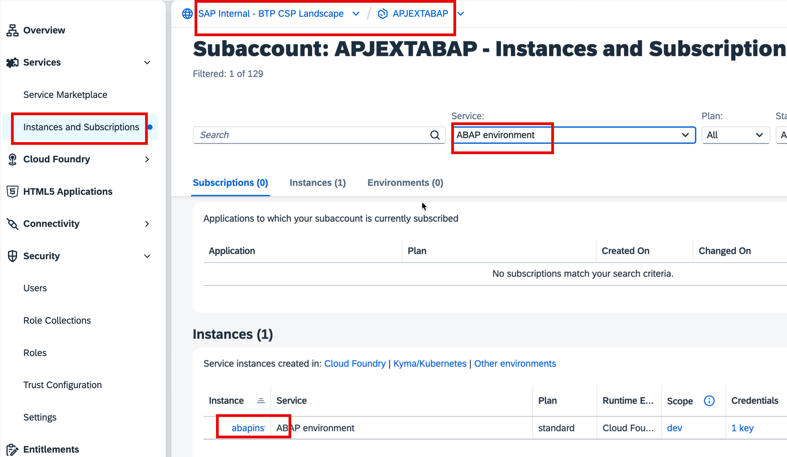
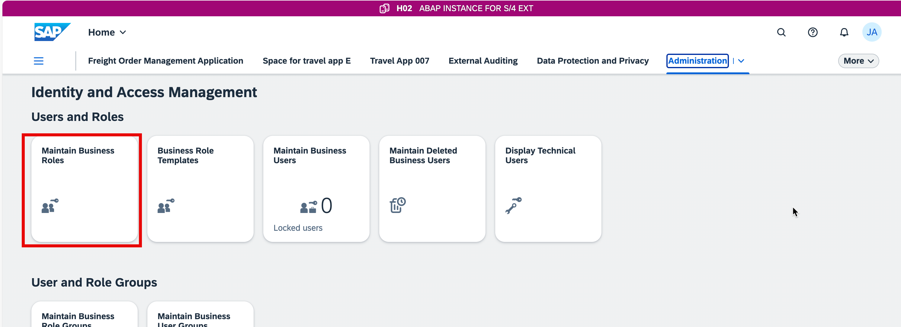
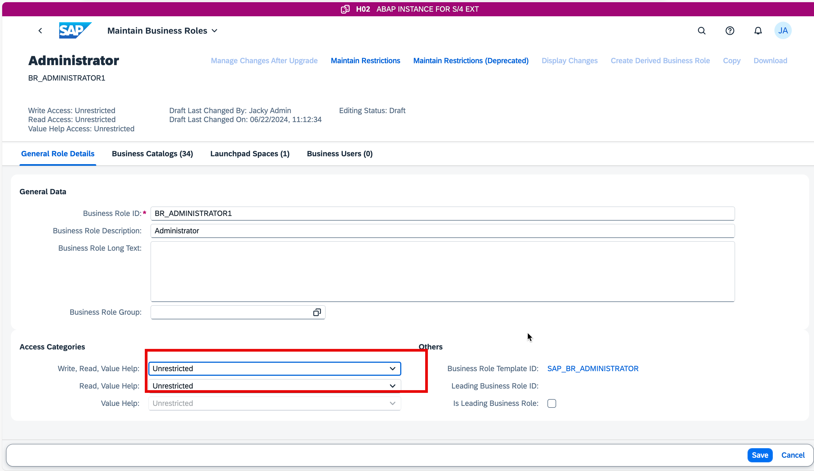
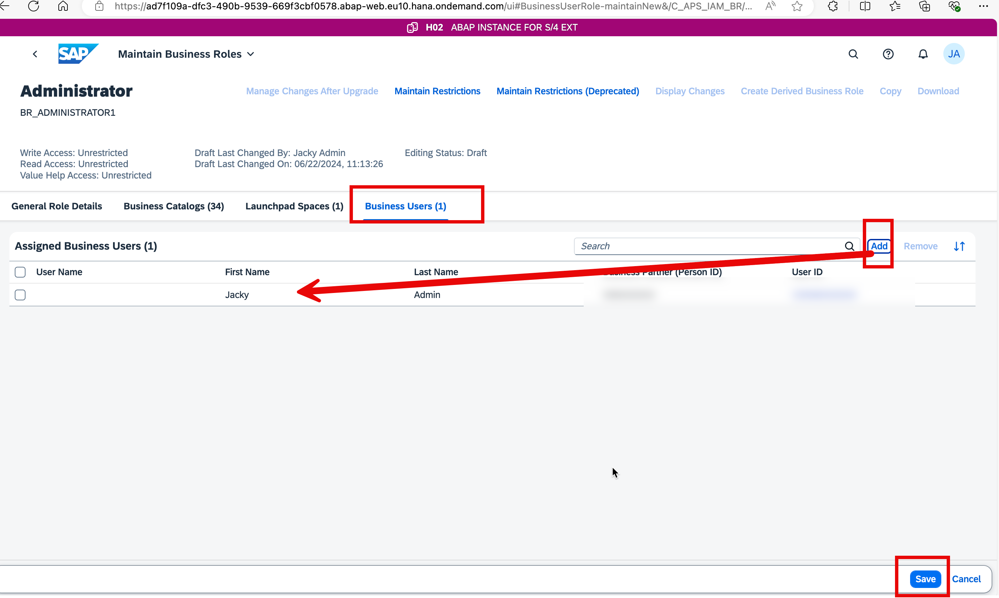
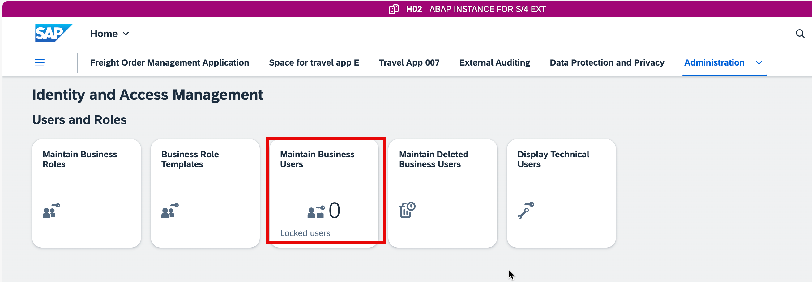
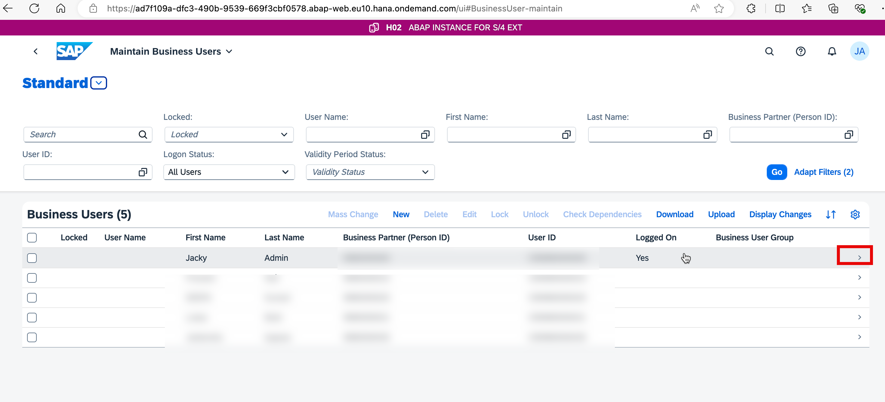
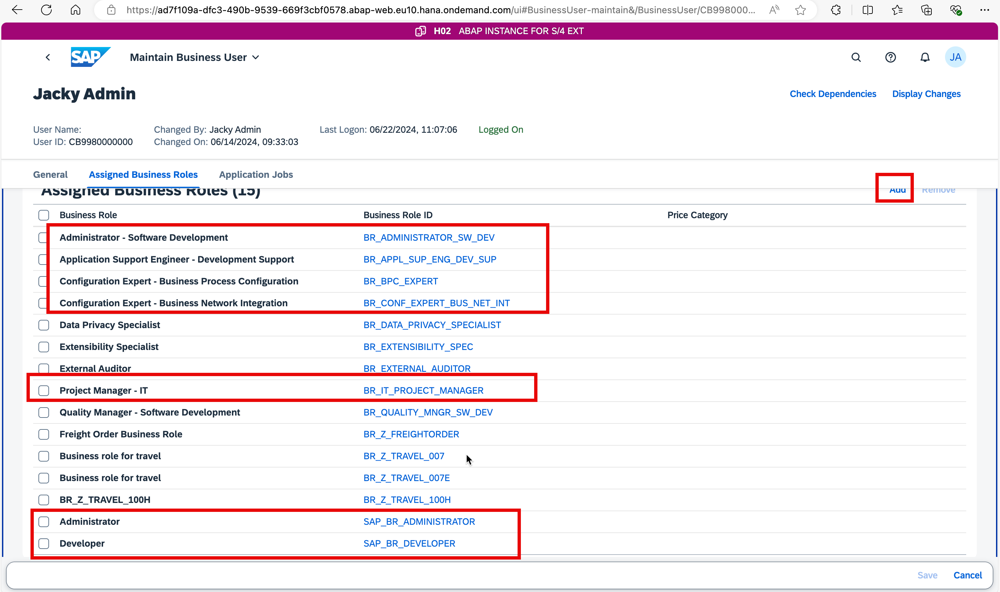

## Step 1: Create rosle from role template:

After input your username and password:

Make sure the following roles exist,if they are missiong ,click **Create From Template** to create them.

## Step 2: Assign the roles to your user account.

Make sure the following roles has been assigned to your user account. If not, click **Add** to add the missing roles.

