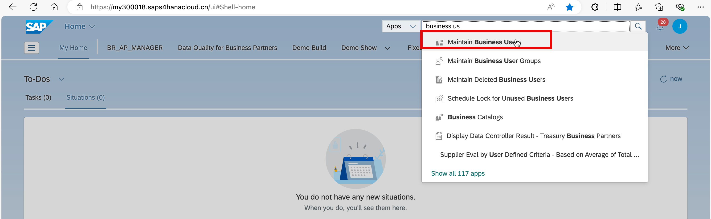
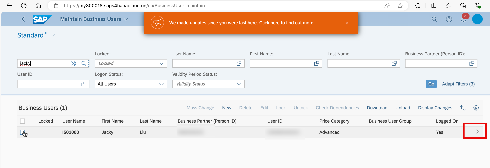
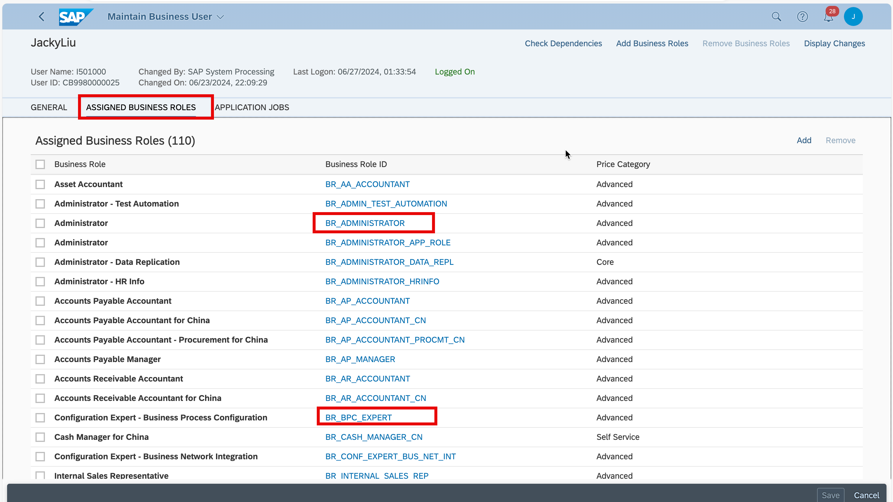
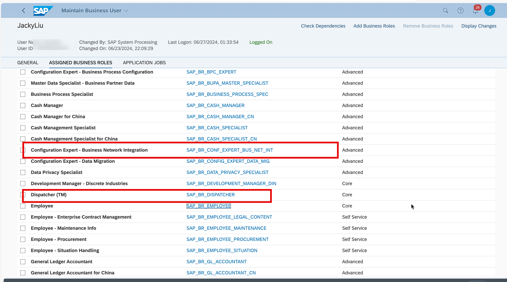

In SAP S/4HANA Cloud, make sure you have the following roles assigned to your user account.

- BR_ADMINISTRATOR oR SAP_BR_ADMINISTRATOR
- BR_DISPATCHER or SAP_BR_DISPATCHER
- BR_BPC_EXPERT or SAP_BR_BPC_EXPERT 
- BR_CONF_EXPERT_BUS_NET_INT or SAP_BR_CONF_EXPERT_BUS_NET_INT

