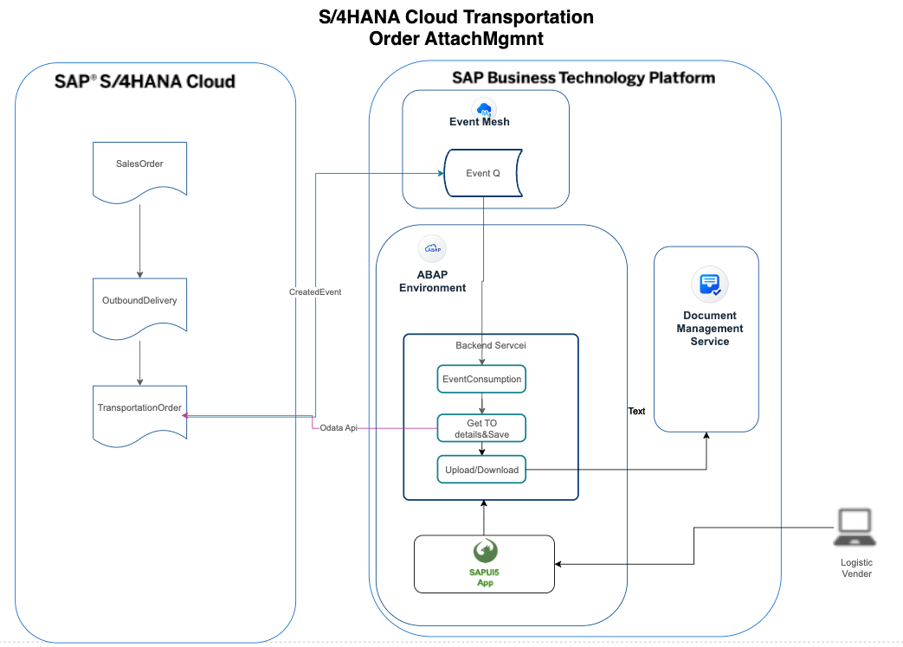

# S/4HANA CLOUD Freight Order Attachment Management in BTP ABAP Environment

## Solution Architecture

## [Segtion 1 Configure Event Mesh in BTP Subaccount](./Segtion%201%20Configure%20Event%20Mesh%20in%20BTP%20Subaccount/README.md)
## [Segtion 2 Configue event in S4HANA Cloud](./Segtion%202%20Configue%20event%20in%20S4HANA%20Cloud/README.md)
## [Segtion 3 Create event Q and subscribe to freight order created topic in BTP Event Mesh Application](./Segtion%203%20Create%20event%20Q%20and%20subscribe%20to%20freight%20order%20created%20topic%20in%20BTP%20Event%20Mesh%20Application/README.md)
## [Segtion 4 Prepare code to  consump event from S4HANA Cloud](./Segtion%204%20Prepare%20code%20to%20%20consump%20event%20from%20S4HANA%20Cloud/README.md)
## [Segtion 5 Communication Arrangement for SAP Event Mesh instance in the SAP BTP ABAP environment system](./Segtion%205%20Communication%20Arrangement%20for%20SAP%20Event%20Mesh%20instance%20in%20the%20SAP%20BTP%20ABAP%20environment%20system/README.md)
## [Segtion 6 Call API to get Freight Order Detail](./Segtion%206%20Call%20API%20to%20get%20Freight%20Order%20Detail/README.md)
## [Segtion 7 Create  data definition for tables](./Segtion%207%20Create%20%20data%20definition%20for%20tables/README.md)
## [Segtion 8 Create service and service binding](./Segtion%208%20Create%20service%20and%20service%20binding/README.md)
## [Segtion 9 Create behavior definition in Eclipse ADT](./Segtion%209%20Create%20behavior%20definition%20in%20Eclipse%20ADT/README.md)
## [Segtion 10 Create Fiori Application in BTP BAS and Deploy it into BTP ABAP Environment](./Segtion%2010%20Create%20Fiori%20Application%20in%20BTP%20BAS%20and%20Deploy%20it%20into%20BTP%20ABAP%20Environment/img/README.md)
## [Segtion 11 Integrate List Report into ABAP Fiori Launchpad](./Segtion%2011/README.md)

