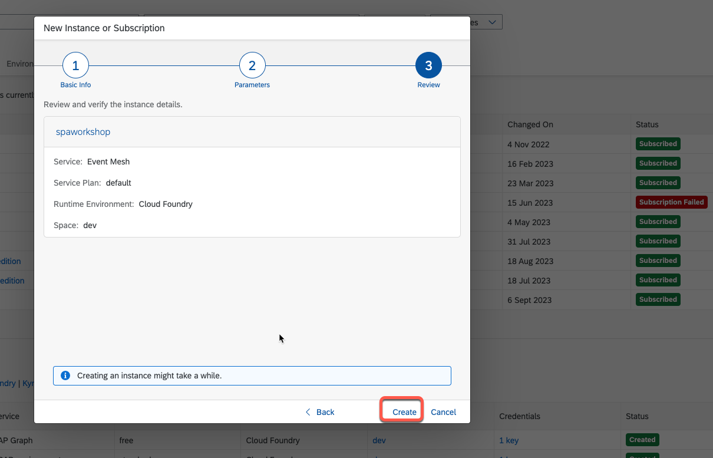
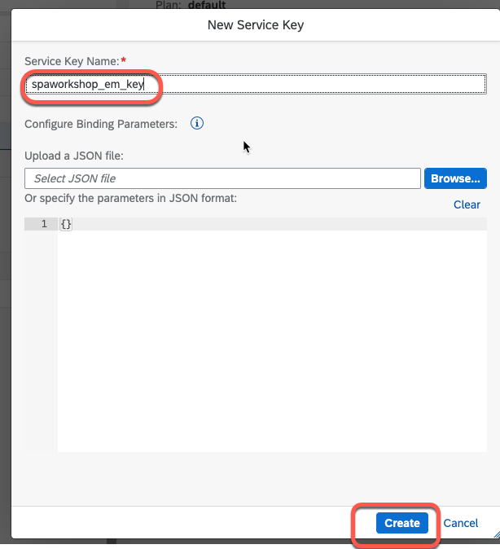
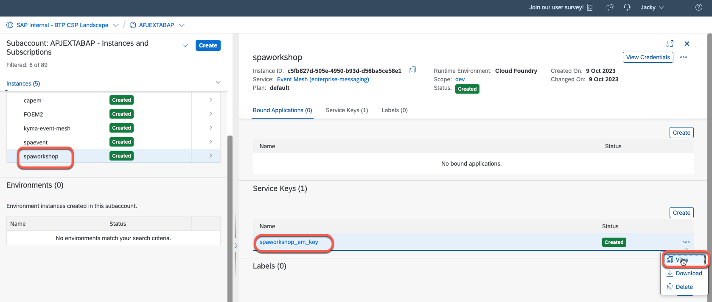

### 1. Create an Event Mesh subscription

If you don’t have an Event Mesh subscription, create a new one. 


### 2. Assign Event Mesh role collections to your user account.


### 3. Create an Event Mesh instance.


You can use the following JSON file:

```json
{
    "emname": "spaworkshop",
    "namespace": "com/sap/spaworkshop",
    "version": "1.1.0",
    "options": {
      "management": true,
      "messagingrest": true,
      "messaging": true
    },
    "rules": {
      "queueRules": {
          "publishFilter": [
              "${namespace}/*"
          ],
          "subscribeFilter": [
              "${namespace}/*"
          ]
      },
      "topicRules": {
          "publishFilter": [
              "${namespace}/*"
          ],
          "subscribeFilter": [
              "${namespace}/*"
          ]
      }
    }
  }
  ```
  


### 4. Create an Event Mesh instance service key






We will use the copied service key to create communication arrangements in SAP S/4Hana Cloud.

