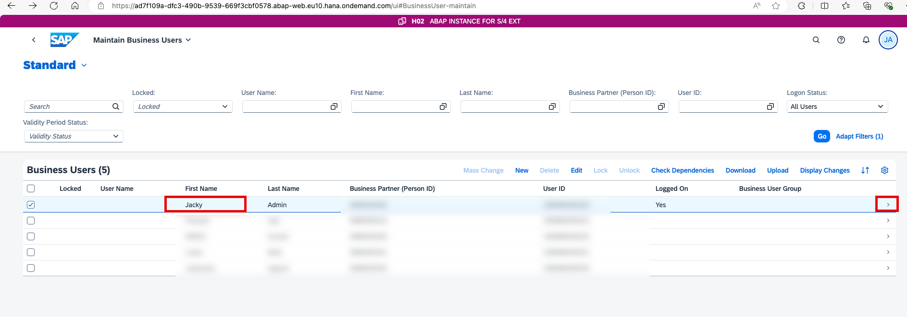
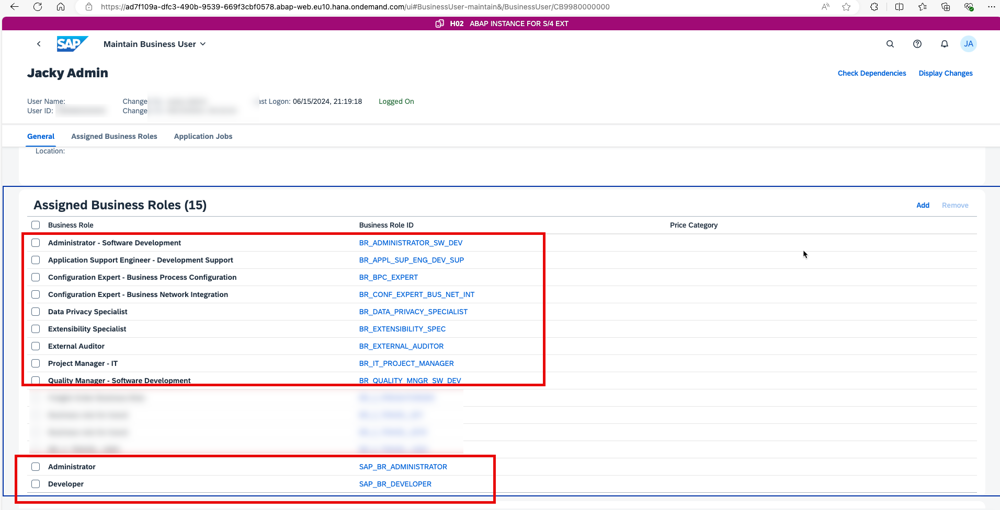
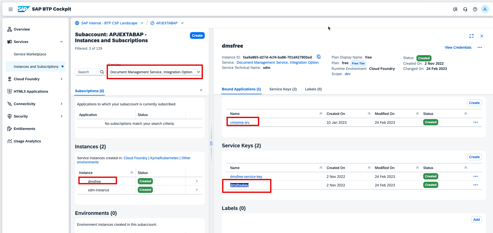
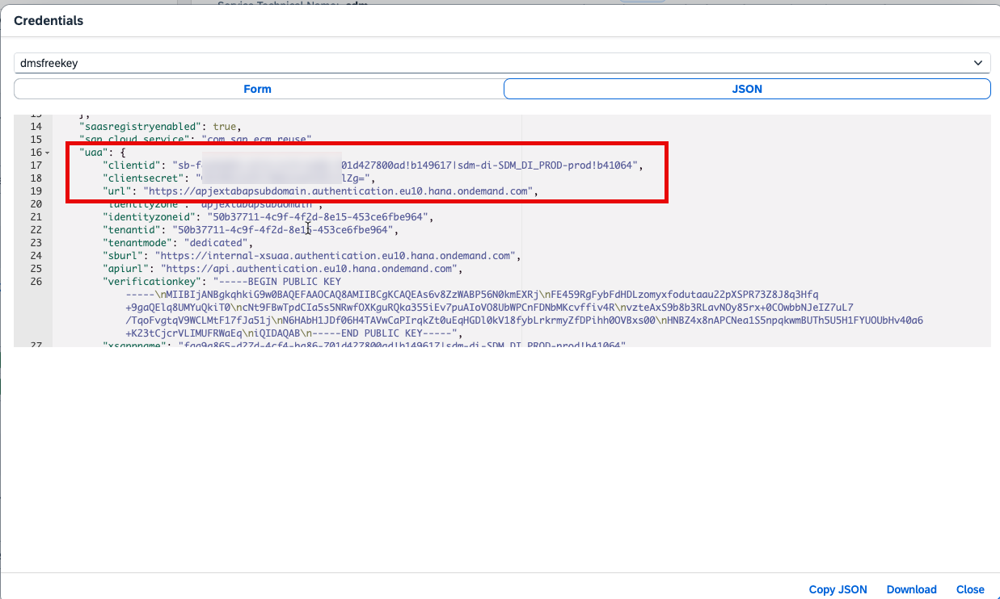
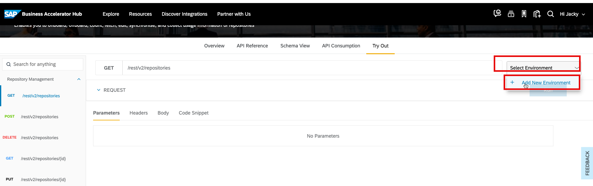
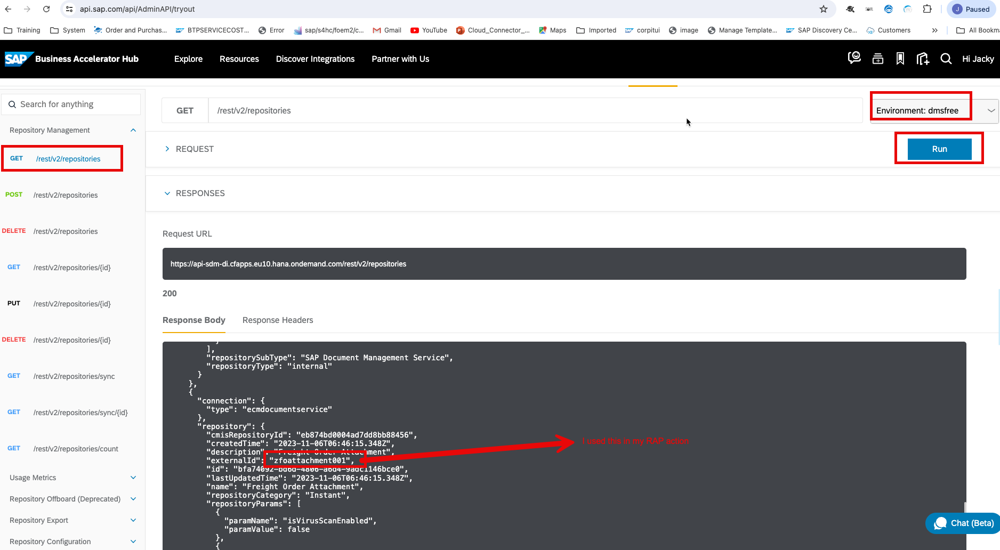
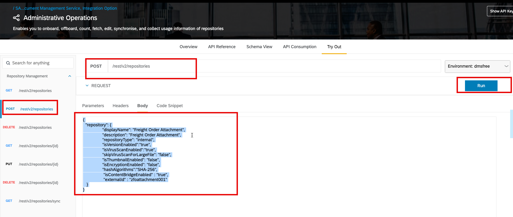
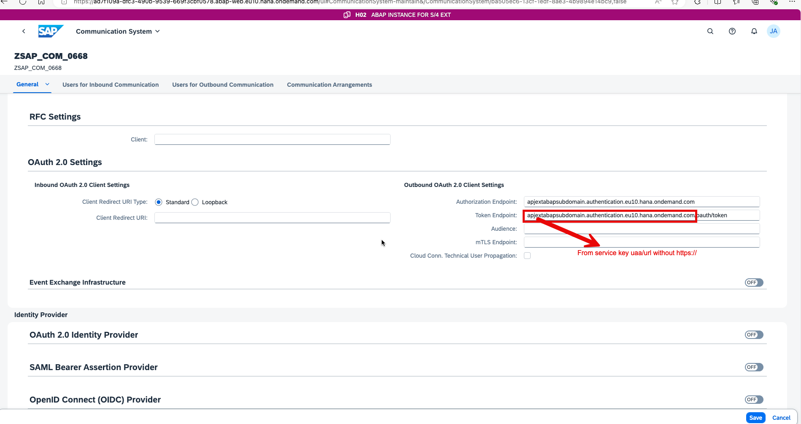
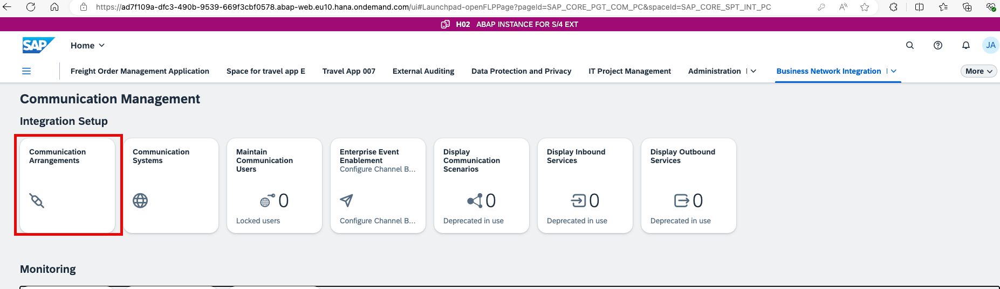
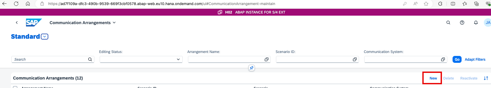

## Prerequisites:
- Please make sure you have the roles in the following screenshots to finish the whole mission.






## step 1. Create a service-instance of SAP Document Management, Integration option. For more information, see - - [Initial Setup for Document Management Service. Integration Option](https://help.sap.com/viewer/f6e70dd4bffa4b65965b43feed4c9429/Cloud/en-US/bc0f1ec7d5374b968e0b0de6db470c94.html) on SAP Help Portal.

As the result, we will get the  service instance and servicef key in BTP Subaccount.





## step 2 Onboard a repository. For more information, see [SAP API Business Hub - Administrative Operations](https://api.sap.com/api/AdminAPI/tryout).

After logining with your username and password.







please change the body as the following, plase keep the external id as zfoattachment001 which will be used in RAP program.

```

{
  "repository": {
		"displayName": "Freight Order Attachment",
		"description": "Freight Order Attachment",
		"repositoryType": "internal",
		"isVersionEnabled":"true",
		"isVirusScanEnabled":"true",
		"skipVirusScanForLargeFile": "false",
		"isThumbnailEnabled": "false",
		"isEncryptionEnabled": "false",
		"hashAlgorithms":"SHA-256",
                 "isContentBridgeEnabled" : "true",
	         "externalId" : "zfoattachment001"
   }
}

```


## step 3  Connect to an ABAP BTP instance, and create a Communication Arrangement for SAP_COM_0668.









