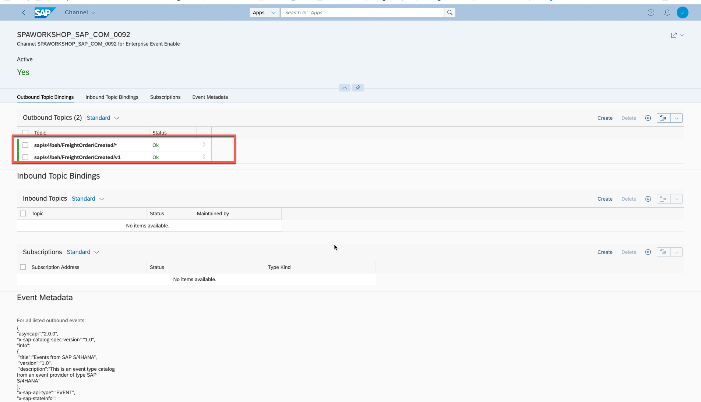
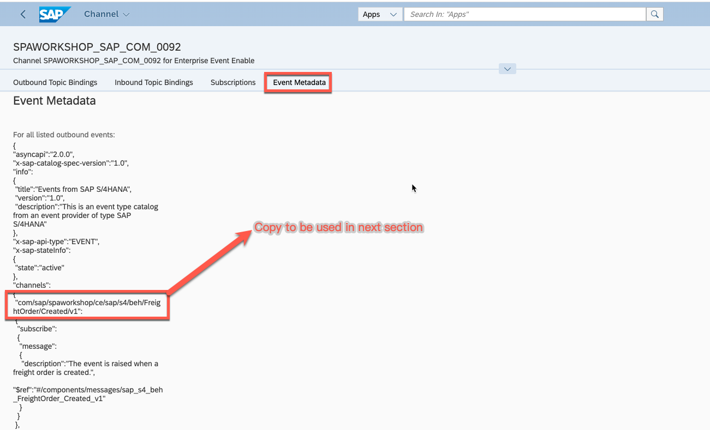

### Prerequisites:
    You have been assigned to the BR_CONF_EXPERT_BUS_NET_INT role in SAP S/4HANA CLOUD.

### 1. Create a communication arrangement in SAP S/4HANA Cloud using the sap_com_0092 communication scenario.

### 2. Configure event channel binding.

    Add another topic:
    sap/s4/beh/FreightOrder/Created/v1
    

com/sap/spaworkshop/ce/sap/s4/beh/FreightOrder/Created/v1

### 3. Save the event metadata to a JSON file 

We will use the JSON file to create an event consumption in Eclipse ADT.

Go back to your channel, scroll down to Event Metadata, and save the metadata as a .json file for later. This specification file contains all of the metadata of the event.

Just like [Metadata](./img/eventmeta.json)  

