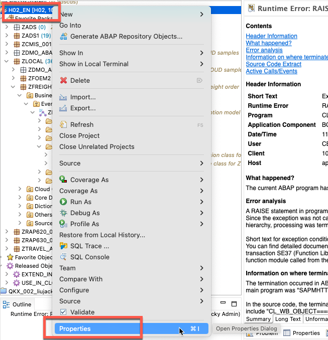
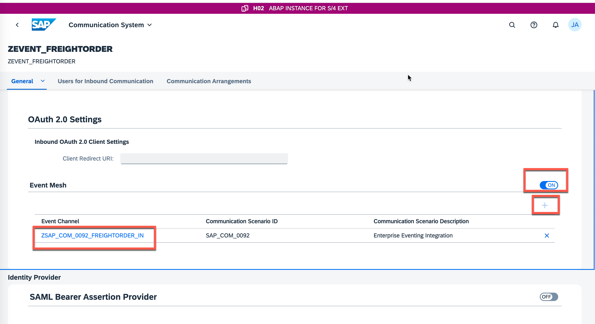
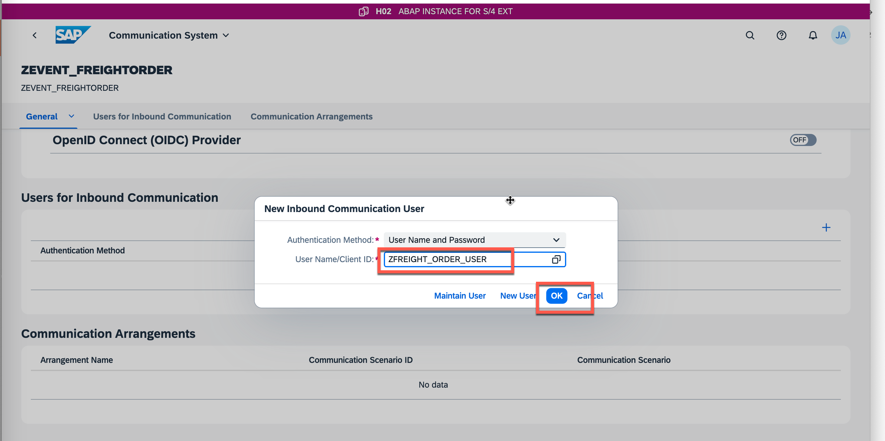
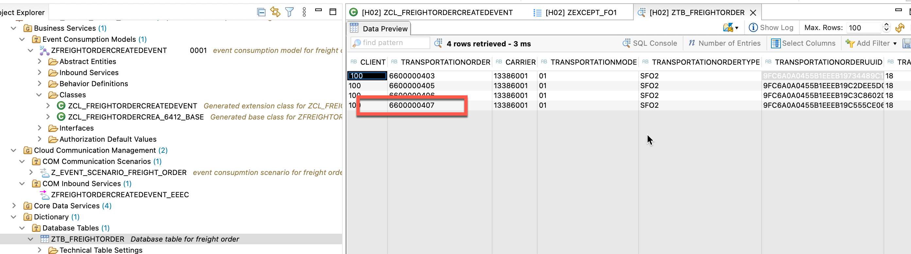

### 1. Communication Arrangement for SAP Event Mesh instance in the SAP BTP ABAP environment system

Then in Fiori launchpad of your SAP BTP ABAP environment system you first need to build a communication arrangement with sap_com_0092 scenario and the same service key instance you used to build your communication arrangement in the cloud system.

### 2. To open the Fiori launchpad right-click your project in ADT and navigate to Properties



### 3. Click Service URL to open the dashboard of this system.


### 4. Navigate to Communication Arrangement and click New to create a communication arrangement.

Choose sap_com_0092 as Scenario and copy the service key of your event mesh instance under Service Key( Section 1 step 4) . You need to create a Communication User. Click New and enter a User Name, Description and Propose Password. Copy the generated password and save it for later. Click Create.


Now you need to change the Arrangement Name to ZSAP_COM_0092_FREIGHTORDER_IN .


## 5. Communication Arrangement for event consumption model in the SAP BTP ABAP environment system

The connection between your BTP system and event mesh instance is done, now you need to create another communication arrangement with the scenario you already published in ADT:

Navigate to **Communication Arrangement**, click **New**.


Choose your created scenario and click Create.


In the communication arrangement you need to define a communication system. Click **New** and enter a System ID and System Name like **ZEVENT_FREIGHTORDER** and click **Create**.




Fill out the inbound username with the user name created in the last step and click OK.




Under General click the Inbound Only option and click **Save**.


In communication arrangement click **Save**.


## 6. Maintain Subscription

Now you need to choose a subscription in your channel to specify in which queue you should get the event message.
In the Fiori launchpad search for Enterprise Event Enablement - Configure Channel Binding App and open it.


Click Go to see a list of channels and choose your channel.


You need to check if the inbound topic from your event consumption model is added successfully in to this channel:

```Reload the page until you can see the inbound topic.```


The subscription status should be **Acknowledged**.


## 7. Create freight order in SAP S/4HANA Cloud


## 8. Check result in table in Eclipse ADT


Right click




