## 1. Create communication arrangement in SAP S/4HANA Cloud to expose Freight Order API .

**prerequisites**:

You user account in SAP SAP S/4HANA Cloud has been assigned with user role **BR_ADMINISTRATOR** or **BR_CONF_EXPERT_BUS_NET_INT**


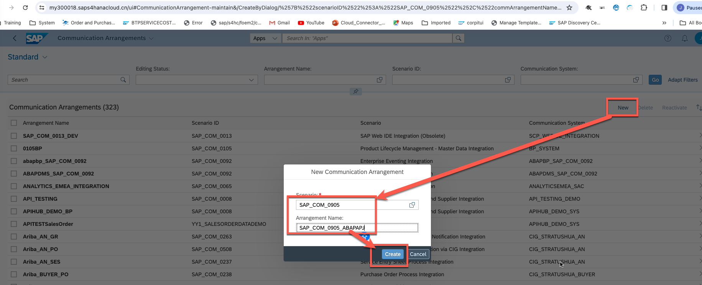


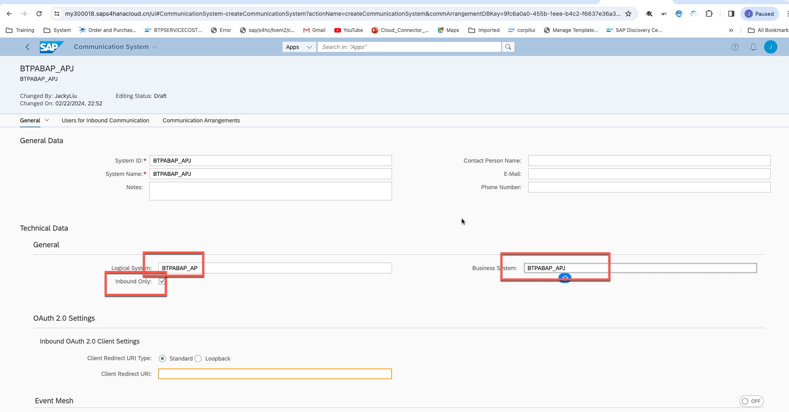


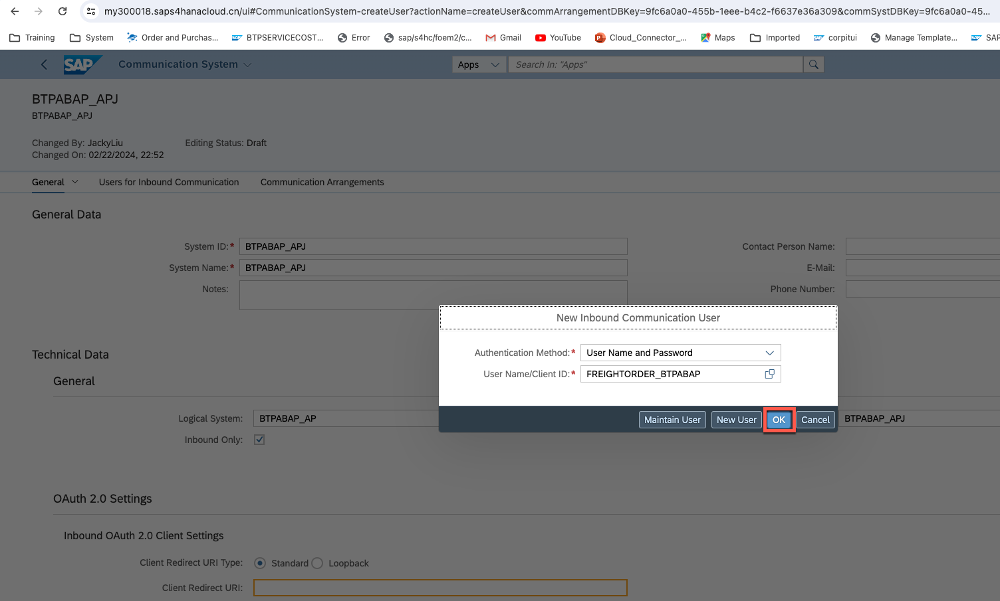


As a result, we get the Freight order api URL address and metadata , user name and password .

## 2. Create consumption model in Eclipse ADT with metadata file from previouse step.


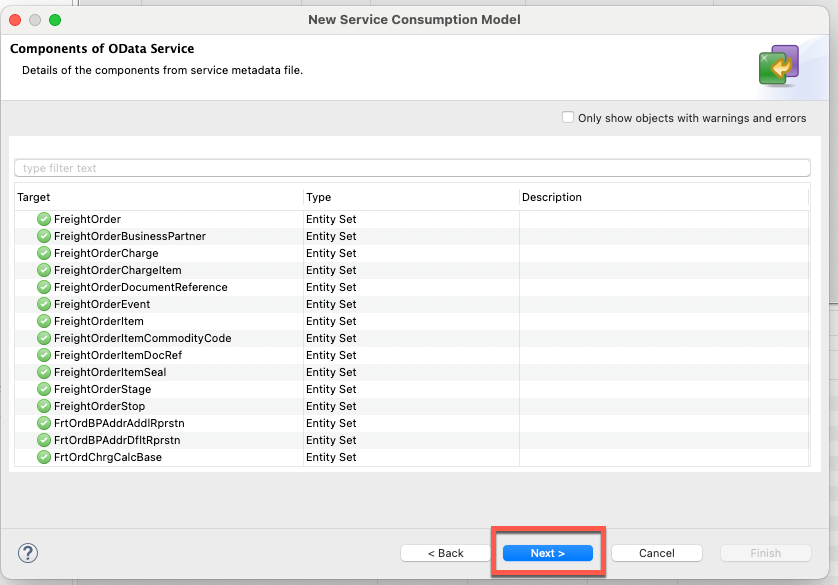


## 3. Create outbound service model and communication scenario in Eclipse ADT .


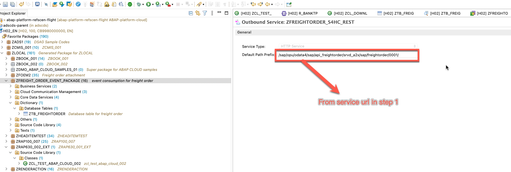


## 4. Create communication scenario in Eclipse ADT .


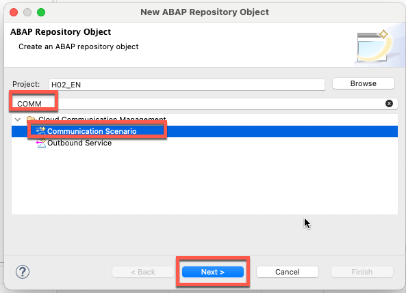


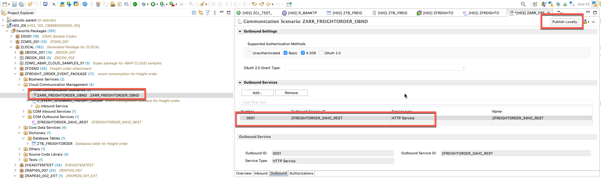

## 5. Create communication arrangement in SAP BTP ABAP environment.


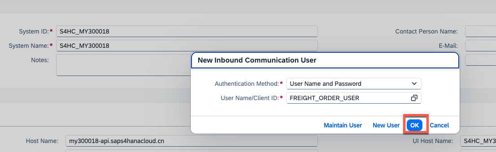

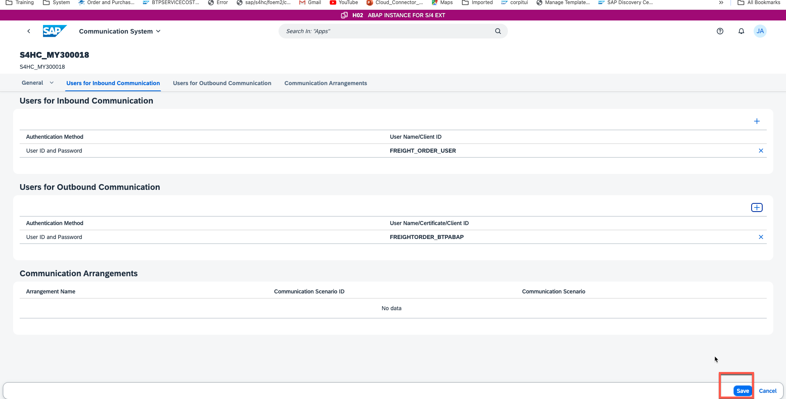
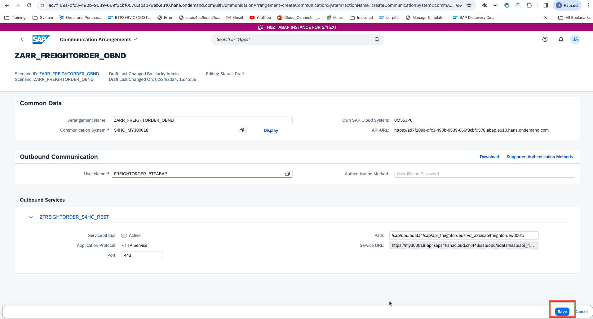


## 6. Create freight order item table in Eclipse Adt .

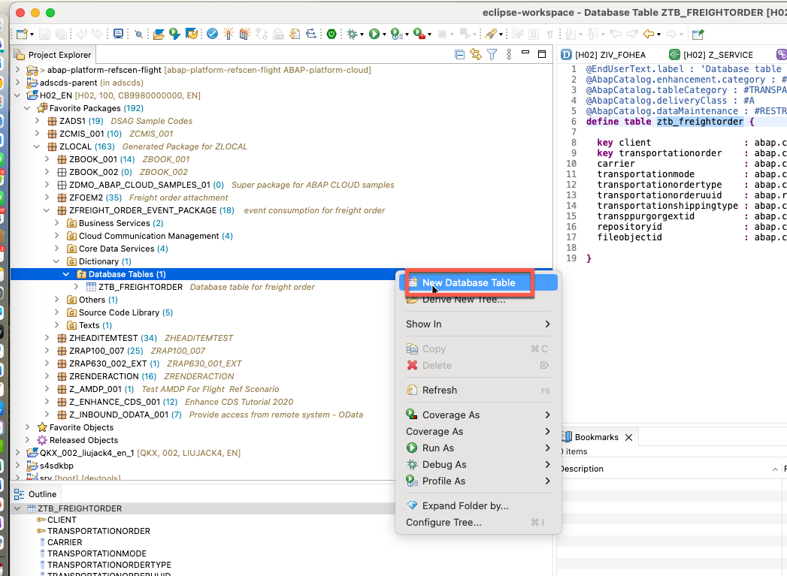

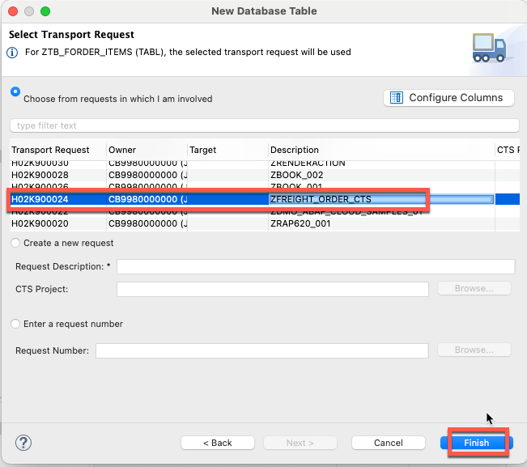
```
@EndUserText.label : 'Freight Order Items'
@AbapCatalog.enhancement.category : #NOT_EXTENSIBLE
@AbapCatalog.tableCategory : #TRANSPARENT
@AbapCatalog.deliveryClass : #A
@AbapCatalog.dataMaintenance : #RESTRICTED
define table ztb_forder_items {

  key client                    : abap.clnt not null;
  key transportation_order_item : sysuuid_x16 not null;
  transportation_order_uuid     : sysuuid_x16;
  transp_ord_item               : abap.char(10);
  transp_ord_item_type          : abap.char(4);
  transp_ord_item_category      : abap.char(3);
  transp_ord_item_desc          : abap.char(40);
  source_stop_uuid              : sysuuid_x16;
  destination_stop_uuid         : sysuuid_x16;
  shipper_uuid                  : sysuuid_x16;
  shipper                       : abap.char(10);
  shipper_address_id            : abap.char(40);
  consignee_uuid                : sysuuid_x16;
  consignee                     : abap.char(10);
  consignee_address_id          : abap.char(40);
  transp_base_document          : abap.char(35);
  transp_base_document_type     : abap.char(5);
  transp_base_document_item     : abap.char(10);
  transportation_equipment_g    : abap.char(3);
  transportation_equipment_t    : abap.char(10);
  transp_equipment_plate_num    : abap.char(20);
  transp_equip_registration     : abap.char(3);
  transp_ord_item_package_id    : abap.char(35);
  product_id                    : abap.char(18);
  material_freight_group        : abap.char(8);
  transportation_group          : abap.char(4);
  @Semantics.quantity.unitOfMeasure : 'ztb_forder_items.transp_ord_item_quantity_u'
  transp_ord_item_quantity      : menge_d;
  transp_ord_item_quantity_u    : meins;
  @Semantics.quantity.unitOfMeasure : 'ztb_forder_items.transp_ord_item_gross_we_2'
  transp_ord_item_gross_weig    : menge_d;
  transp_ord_item_gross_we_2    : meins;
  @Semantics.quantity.unitOfMeasure : 'ztb_forder_items.transp_ord_item_gross_vo_2'
  transp_ord_item_gross_volu    : menge_d;
  transp_ord_item_gross_vo_2    : meins;
  @Semantics.quantity.unitOfMeasure : 'ztb_forder_items.transp_ord_item_net_weig_2'
  transp_ord_item_net_weight    : menge_d;
  transp_ord_item_net_weig_2    : meins;
  transp_ord_item_dngrs_gds     : abap.char(1);
  repositoryid                  : cmis_repository_id;
  fileobjectid                  : cmis_id;

}

```
Push ***command + s*** in Mac to save then ***acivate*** it .


## 7. Create freight order table in Eclipse Adt .


```
@EndUserText.label : 'Database table for freight order'
@AbapCatalog.enhancement.category : #NOT_EXTENSIBLE
@AbapCatalog.tableCategory : #TRANSPARENT
@AbapCatalog.deliveryClass : #A
@AbapCatalog.dataMaintenance : #RESTRICTED
define table ztb_freightorder {

  key client                  : abap.clnt not null;
  key transportationorderuuid : sysuuid_x16 not null;
  transportationorder         : abap.char(20) not null;
  carrier_uuid                : sysuuid_x16;
  carrier                     : abap.char(10);
  shipper_uuid                : sysuuid_x16;
  shipper                     : abap.char(10);
  shipper_address_id          : abap.char(40);
  consignee_uuid              : sysuuid_x16;
  consignee                   : abap.char(10);
  consignee_address_id        : abap.char(40);
  transp_purg_org             : abap.char(8);
  transp_purg_group           : abap.char(8);
  purg_org_company_code       : abap.char(4);
  carrier_account_number      : abap.char(14);
  transp_ord_invoicing_carri  : abap.char(2);
  created_by_user             : abap.char(12);
  creation_date_time          : xsddatetime_iso;
  transportationmode          : abap.char(2);
  transportationordertype     : abap.char(4);
  transportationshippingtype  : abap.char(3);
  transppurgorgextid          : abap.char(20);
  transportation_mode_catego  : abap.char(1);
  transp_ord_execution_is_bl  : abap_boolean;
  transportation_order_exec   : abap.char(2);
  repositoryid                : cmis_repository_id;
  fileobjectid                : cmis_id;

}
```

Push ***command + s*** in Mac to save then ***acivate*** it .


## 8. Adjust event handler to call service consumption model in Eclipse Adt. Please don't just copy and paste the code.

Before adjust
``` ABAP
class ZCL_FREIGHTORDERCREATEDEVENT definition
  public
  inheriting from ZCL_FREIGHTORDERCREA_6412_BASE
  final
  create public .

public section.

  methods ZIF_FREIGHTORDERC_1822_HANDLER~HANDLE_FREIGHTORDER_CREATED_V1
    redefinition .
protected section.
private section.
ENDCLASS.


CLASS ZCL_FREIGHTORDERCREATEDEVENT IMPLEMENTATION.


METHOD ZIF_FREIGHTORDERC_1822_HANDLER~HANDLE_FREIGHTORDER_CREATED_V1.


   DATA ls_business_data TYPE STRUCTURE FOR HIERARCHY Z_FreightOrder_Created_v1_568B.
   data wa type ztb_freightorder .
   ls_business_data = io_event->get_business_data( ).
   wa-carrier = ls_business_data-Carrier.
   wa-transportationmode = ls_business_data-TransportationMode.
   wa-transportationorder = ls_business_data-TransportationOrder .
   wa-transportationordertype = ls_business_data-TransportationOrderType .
   wa-transportationorderuuid = ls_business_data-TransportationOrderUUID .
   wa-transportationshippingtype = ls_business_data-TransportationShippingType .
   INSERT ztb_freightorder from @wa .


ENDMETHOD.
ENDCLASS.
```

After adjustment 

```ABAP
CLASS zcl_freightordercreatedevent DEFINITION
  PUBLIC
  INHERITING FROM zcl_freightordercrea_6412_base
  FINAL
  CREATE PUBLIC .

  PUBLIC SECTION.

    METHODS zif_freightorderc_1822_handler~handle_freightorder_created_v1
        REDEFINITION .
  PROTECTED SECTION.
  PRIVATE SECTION.
ENDCLASS.


CLASS zcl_freightordercreatedevent IMPLEMENTATION.


  METHOD zif_freightorderc_1822_handler~handle_freightorder_created_v1.


    DATA:
      ls_entity_key           TYPE zcl_freightorder_consumption=>tys_freight_order_type,
      ls_business_data_header TYPE zcl_freightorder_consumption=>tys_freight_order_type,
      lo_http_client          TYPE REF TO if_web_http_client,
      lo_resource             TYPE REF TO /iwbep/if_cp_resource_entity,
      lo_client_proxy         TYPE REF TO /iwbep/if_cp_client_proxy,
      lo_request              TYPE REF TO /iwbep/if_cp_request_read,
      lo_request_list         TYPE REF TO /iwbep/if_cp_request_read_list,
      lo_response             TYPE REF TO /iwbep/if_cp_response_read.
    DATA:
      lt_business_data_item TYPE TABLE OF zcl_freightorder_consumption=>tys_freight_order_item_type,
      ls_business_data_item LIKE LINE OF lt_business_data_item,
      lo_response_items     TYPE REF TO /iwbep/if_cp_response_read_lst.
    DATA:
      lo_filter_factory          TYPE REF TO /iwbep/if_cp_filter_factory,
      lo_filter_node_1           TYPE REF TO /iwbep/if_cp_filter_node,
      lo_filter_node_2           TYPE REF TO /iwbep/if_cp_filter_node,
      lo_filter_node_root        TYPE REF TO /iwbep/if_cp_filter_node,
      lt_range_TRANSP_ORDER_ITEM TYPE RANGE OF sysuuid_x16,
      lt_range_TRANSP_ORDER_UUID TYPE RANGE OF sysuuid_x16,
      ls_range_TRANSP_ORDER_UUID LIKE LINE OF lt_range_TRANSP_ORDER_UUID.


    DATA ls_business_data TYPE STRUCTURE FOR HIERARCHY Z_FreightOrder_Created_v1_568B.
    DATA wa TYPE ztb_freightorder .
    DATA wa_item TYPE ztb_forder_items .
    ls_business_data = io_event->get_business_data( ).
    wa-carrier = ls_business_data-Carrier.
    wa-transportationmode = ls_business_data-TransportationMode.
    wa-transportationorder = ls_business_data-TransportationOrder .
    wa-transportationordertype = ls_business_data-TransportationOrderType .
    wa-transportationorderuuid = ls_business_data-TransportationOrderUUID .
    wa-transportationshippingtype = ls_business_data-TransportationShippingType .


    TRY.
        " Create http client
        DATA(lo_destination) = cl_http_destination_provider=>create_by_comm_arrangement(
                                                     comm_scenario  = 'ZARR_FREIGHTORDER_OBND'
                                                     comm_system_id = 'S4HC_MY300018'
                                                     service_id     = 'ZFREIGHTORDER_S4HC_REST' ).
        lo_http_client = cl_web_http_client_manager=>create_by_http_destination( lo_destination ).
        lo_client_proxy = /iwbep/cl_cp_factory_remote=>create_v4_remote_proxy(
          EXPORTING
             is_proxy_model_key       = VALUE #( repository_id       = 'DEFAULT'
                                                 proxy_model_id      = 'ZFREIGHTORDER_CONSUMPTION'
                                                 proxy_model_version = '0001' )
            io_http_client             = lo_http_client
            iv_relative_service_root   = ''
             ).

        ASSERT lo_http_client IS BOUND.


        " Set entity key
        ls_entity_key = VALUE #(
                  transportation_order_uuid  = ls_business_data-TransportationOrderUUID ).


        " Navigate to the resource
        lo_resource = lo_client_proxy->create_resource_for_entity_set( 'FREIGHT_ORDER' )->navigate_with_key( ls_entity_key ).

        " Execute the request and retrieve the business data
        lo_response = lo_resource->create_request_for_read( )->execute( ).
        lo_response->get_business_data( IMPORTING es_business_data = ls_business_data_header ).
        MOVE-CORRESPONDING ls_business_data_header TO wa .
        INSERT ztb_freightorder FROM @wa .

*        out->write( ls_business_data-transportation_order ).


        lo_request_list = lo_client_proxy->create_resource_for_entity_set( 'FREIGHT_ORDER_ITEM' )->create_request_for_read( ).

        lo_filter_factory = lo_request_list->create_filter_factory( ).

*lo_filter_node_1  = lo_filter_factory->create_by_range( iv_property_path     = 'TRANSPORTATION_ORDER_ITEM'
*                                                        it_range             = lt_range_TRANSPORTATION_ORDER_ITEM ).


        ls_range_TRANSP_ORDER_UUID-sign = 'I'.
        ls_range_TRANSP_ORDER_UUID-option = 'EQ' .
        ls_range_TRANSP_ORDER_UUID-low = ls_business_data-TransportationOrderUUID .
        ls_range_TRANSP_ORDER_UUID-high = ls_business_data-TransportationOrderUUID .
        APPEND ls_range_TRANSP_ORDER_UUID TO lt_range_TRANSP_ORDER_UUID .


        lo_filter_node_2  = lo_filter_factory->create_by_range( iv_property_path     = 'TRANSPORTATION_ORDER_UUID'
                                                                it_range             = lt_range_TRANSP_ORDER_UUID ).

        lo_request_list->set_filter( lo_filter_node_2 ).


        lo_response_items = lo_request_list->execute( ).
        lo_response_items->get_business_data( IMPORTING et_business_data = lt_business_data_item ).

        IF lt_business_data_item[] IS NOT INITIAL .
          LOOP AT lt_business_data_item INTO ls_business_data_item .
            MOVE-CORRESPONDING ls_business_data_item TO wa_item .
            INSERT ztb_forder_items FROM @wa_item .
          ENDLOOP.
        ENDIF.

      CATCH /iwbep/cx_cp_remote INTO DATA(lx_remote).
*        out->write( 'error in remote' ).
        " Handle remote Exception
        " It contains details about the problems of your http(s) connection

      CATCH /iwbep/cx_gateway INTO DATA(lx_gateway).
*        out->write( 'error in gateway' ).
        " Handle Exception

      CATCH cx_web_http_client_error INTO DATA(lx_web_http_client_error).
        " Handle Exception
        RAISE SHORTDUMP lx_web_http_client_error.


    ENDTRY.


  ENDMETHOD.
ENDCLASS.

```

Push ***command + s*** in Mac to save then ***acivate*** it .


## 9. Create freight order in SAP S/4HANA Cloud and check the Freight order and freight order item table in Eclipse ADT .

### Create freight order in SAP S/4HANA Cloud


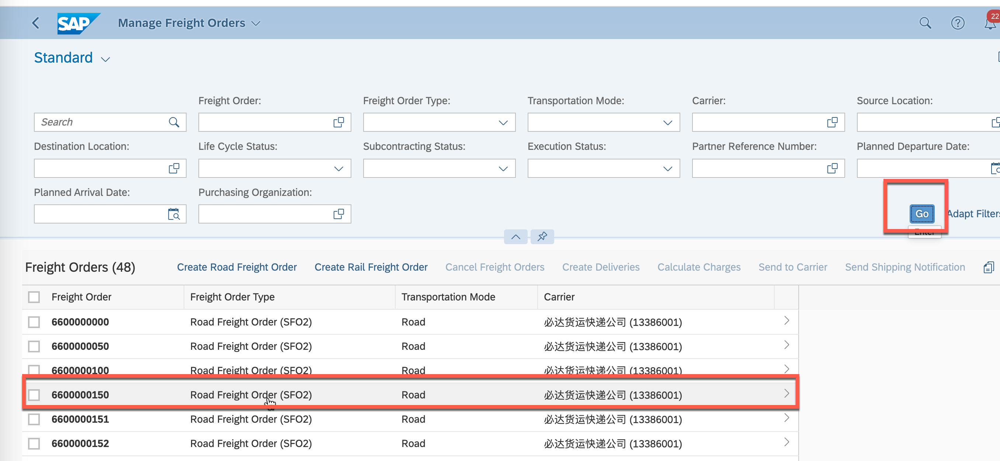


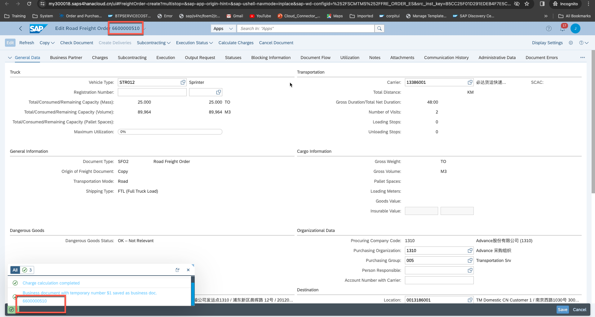

### Check result in table in Eclipse ADT


Right click


