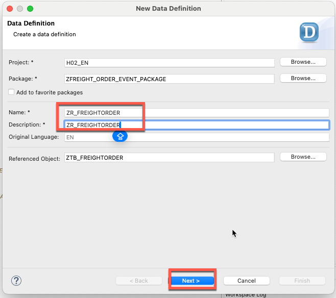
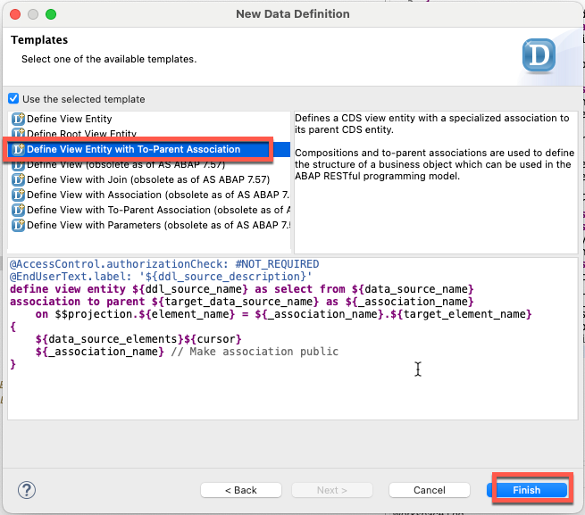
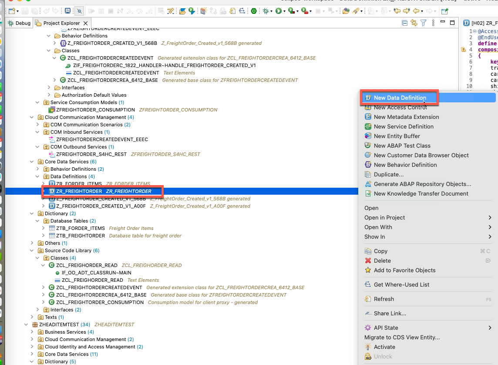
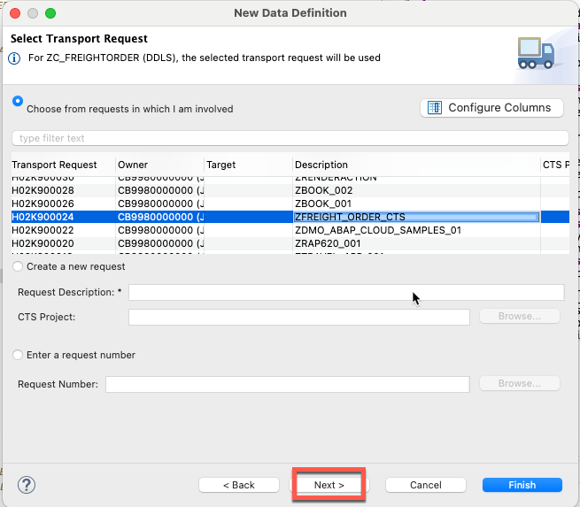
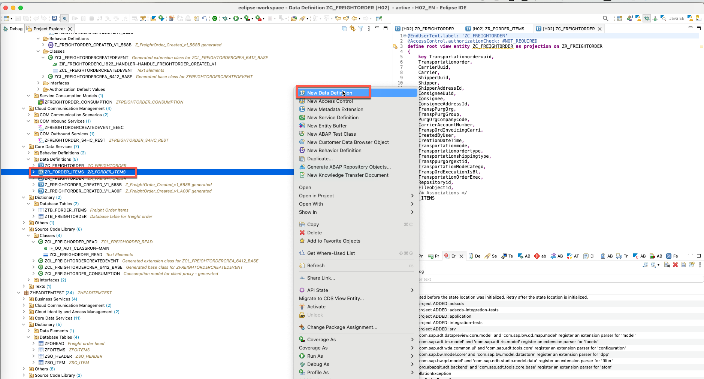

## 1. Create data definition for table ztb_freightorder.





```
@AccessControl.authorizationCheck: #NOT_REQUIRED
@EndUserText.label: 'ZR_FREIGHTORDER'
define root view entity ZR_FREIGHTORDER as select from ZTB_FREIGHTORDER
//composition [0..*] of ZR_FORDER_ITEMS as _ITEMS
{
    key transportationorderuuid as Transportationorderuuid,
    transportationorder as Transportationorder,
    carrier_uuid as CarrierUuid,
    carrier as Carrier,
    shipper_uuid as ShipperUuid,
    shipper as Shipper,
    shipper_address_id as ShipperAddressId,
    consignee_uuid as ConsigneeUuid,
    consignee as Consignee,
    consignee_address_id as ConsigneeAddressId,
    transp_purg_org as TranspPurgOrg,
    transp_purg_group as TranspPurgGroup,
    purg_org_company_code as PurgOrgCompanyCode,
    carrier_account_number as CarrierAccountNumber,
    transp_ord_invoicing_carri as TranspOrdInvoicingCarri,
    created_by_user as CreatedByUser,
    creation_date_time as CreationDateTime,
    transportationmode as Transportationmode,
    transportationordertype as Transportationordertype,
    transportationshippingtype as Transportationshippingtype,
    transppurgorgextid as Transppurgorgextid,
    transportation_mode_catego as TransportationModeCatego,
    transp_ord_execution_is_bl as TranspOrdExecutionIsBl,
    transportation_order_exec as TransportationOrderExec,
    repositoryid as Repositoryid,
    fileobjectid as Fileobjectid 
//    _ITEMS // Make association public
}
```

Push ***Command + S*** in Mac and activate it .

## 2. Create data definition for table ztb_forder_items.




Adjust the code like the following.

```
@AccessControl.authorizationCheck: #NOT_REQUIRED
@EndUserText.label: 'ZR_FORDER_ITEMS'
define view entity ZR_FORDER_ITEMS
  as select from ztb_forder_items
  association to parent ZR_FREIGHTORDER as _FREIGHTORDER on $projection.TransportationOrderUuid = _FREIGHTORDER.Transportationorderuuid
{
  key transportation_order_item  as TransportationOrderItem,
      transportation_order_uuid  as TransportationOrderUuid,
      transp_ord_item            as TranspOrdItem,
      transp_ord_item_type       as TranspOrdItemType,
      transp_ord_item_category   as TranspOrdItemCategory,
      transp_ord_item_desc       as TranspOrdItemDesc,
      source_stop_uuid           as SourceStopUuid,
      destination_stop_uuid      as DestinationStopUuid,
      shipper_uuid               as ShipperUuid,
      shipper                    as Shipper,
      shipper_address_id         as ShipperAddressId,
      consignee_uuid             as ConsigneeUuid,
      consignee                  as Consignee,
      consignee_address_id       as ConsigneeAddressId,
      transp_base_document       as TranspBaseDocument,
      transp_base_document_type  as TranspBaseDocumentType,
      transp_base_document_item  as TranspBaseDocumentItem,
      transportation_equipment_g as TransportationEquipmentG,
      transportation_equipment_t as TransportationEquipmentT,
      transp_equipment_plate_num as TranspEquipmentPlateNum,
      transp_equip_registration  as TranspEquipRegistration,
      transp_ord_item_package_id as TranspOrdItemPackageId,
      product_id                 as ProductId,
      material_freight_group     as MaterialFreightGroup,
      transportation_group       as TransportationGroup,
      @Semantics.quantity: {
      unitOfMeasure: 'TranspOrdItemQuantityU'
      }
      transp_ord_item_quantity   as TranspOrdItemQuantity,
      transp_ord_item_quantity_u as TranspOrdItemQuantityU,
      @Semantics.quantity: {
      unitOfMeasure: 'TranspOrdItemGrossWe2'
      }
      transp_ord_item_gross_weig as TranspOrdItemGrossWeig,
      transp_ord_item_gross_we_2 as TranspOrdItemGrossWe2,
      @Semantics.quantity: {
      unitOfMeasure: 'TranspOrdItemGrossVo2'
      }
      transp_ord_item_gross_volu as TranspOrdItemGrossVolu,
      transp_ord_item_gross_vo_2 as TranspOrdItemGrossVo2,
      @Semantics.quantity: {
          unitOfMeasure: 'TranspOrdItemNetWeig2'
      }
      transp_ord_item_net_weight as TranspOrdItemNetWeight,
      transp_ord_item_net_weig_2 as TranspOrdItemNetWeig2,
      transp_ord_item_dngrs_gds  as TranspOrdItemDngrsGds,
      repositoryid as Repositoryid,
      fileobjectid as Fileobjectid, 
      _FREIGHTORDER // Make association public
}

```

Push ***Command + S*** in Mac and activate it .

## 3. Update data definition ZR_FREIGHTORDER and re-activate it .

```
@AccessControl.authorizationCheck: #NOT_REQUIRED
@EndUserText.label: 'ZR_FREIGHTORDER'
define root view entity ZR_FREIGHTORDER as select from ztb_freightorder
composition [0..*] of ZR_FORDER_ITEMS as _ITEMS
{
    key transportationorderuuid as Transportationorderuuid,
    transportationorder as Transportationorder,
    carrier_uuid as CarrierUuid,
    carrier as Carrier,
    shipper_uuid as ShipperUuid,
    shipper as Shipper,
    shipper_address_id as ShipperAddressId,
    consignee_uuid as ConsigneeUuid,
    consignee as Consignee,
    consignee_address_id as ConsigneeAddressId,
    transp_purg_org as TranspPurgOrg,
    transp_purg_group as TranspPurgGroup,
    purg_org_company_code as PurgOrgCompanyCode,
    carrier_account_number as CarrierAccountNumber,
    transp_ord_invoicing_carri as TranspOrdInvoicingCarri,
    created_by_user as CreatedByUser,
    creation_date_time as CreationDateTime,
    transportationmode as Transportationmode,
    transportationordertype as Transportationordertype,
    transportationshippingtype as Transportationshippingtype,
    transppurgorgextid as Transppurgorgextid,
    transportation_mode_catego as TransportationModeCatego,
    transp_ord_execution_is_bl as TranspOrdExecutionIsBl,
    transportation_order_exec as TransportationOrderExec,
    repositoryid as Repositoryid,
    fileobjectid as Fileobjectid, 
    _ITEMS // Make association public
}
```

Push ***Command + S*** in Mac and activate it .


## 4. Create projection view for ZR_FREIGHTORDER.






```
@EndUserText.label: 'ZC_FREIGHTORDER'
@AccessControl.authorizationCheck: #CHECK

@Metadata: {
    allowExtensions: true
}
define root view entity ZC_FREIGHTORDER as projection on ZR_FREIGHTORDER
{
    key Transportationorderuuid,
    Transportationorder,
    CarrierUuid,
    Carrier,
    ShipperUuid,
    Shipper,
    ShipperAddressId,
    ConsigneeUuid,
    Consignee,
    ConsigneeAddressId,
    TranspPurgOrg,
    TranspPurgGroup,
    PurgOrgCompanyCode,
    CarrierAccountNumber,
    TranspOrdInvoicingCarri,
    CreatedByUser,
    CreationDateTime,
    Transportationmode,
    Transportationordertype,
    Transportationshippingtype,
    Transppurgorgextid,
    TransportationModeCatego,
    TranspOrdExecutionIsBl,
    TransportationOrderExec,
    Repositoryid,
    Fileobjectid,
    /* Associations */
    _ITEMS : redirected to composition child ZC_FORDER_ITEMS
}
```

Push ***Command + S*** in Mac and activate it .

## 5. Create projection view for ZR_FORDER_ITEMS.




Adjust the code as like following:

```ABAP
@EndUserText.label: 'Projection view for ZR_FORDER_ITEMS'
@AccessControl.authorizationCheck: #CHECK
@Metadata: {
    allowExtensions: true
}
@Search: {
    searchable: true
}
@ObjectModel.semanticKey: [ 'TranspOrdItem' ]

define view entity ZC_FORDER_ITEMS
  as projection on ZR_FORDER_ITEMS
{
  key TransportationOrderItem,
      TransportationOrderUuid,
      @Search.defaultSearchElement: true
      @Search.fuzzinessThreshold: 0.9
      TranspOrdItem,
      TranspOrdItemType,
      TranspOrdItemCategory,
      @Search.defaultSearchElement: true
      @Search.fuzzinessThreshold: 0.9
      TranspOrdItemDesc,
      SourceStopUuid,
      DestinationStopUuid,
      ShipperUuid,
      @Search.defaultSearchElement: true
      @Search.fuzzinessThreshold: 0.9
      Shipper,
      @Search.defaultSearchElement: true
      @Search.fuzzinessThreshold: 0.9
      ShipperAddressId,
      ConsigneeUuid,
      Consignee,
      ConsigneeAddressId,
      TranspBaseDocument,
      TranspBaseDocumentType,
      TranspBaseDocumentItem,
      TransportationEquipmentG,
      TransportationEquipmentT,
      TranspEquipmentPlateNum,
      TranspEquipRegistration,
      TranspOrdItemPackageId,
      @Search.defaultSearchElement: true
      @Search.fuzzinessThreshold: 0.9
      ProductId,
      MaterialFreightGroup,
      TransportationGroup,
      TranspOrdItemQuantity,
      TranspOrdItemQuantityU,
      TranspOrdItemGrossWeig,
      TranspOrdItemGrossWe2,
      TranspOrdItemGrossVolu,
      TranspOrdItemGrossVo2,
      TranspOrdItemNetWeight,
      TranspOrdItemNetWeig2,
      TranspOrdItemDngrsGds,
      Repositoryid,
      Fileobjectid,
      /* Associations */
      _FREIGHTORDER : redirected to parent ZC_FREIGHTORDER
}

```

Push ***Command + S*** in Mac and activate it .


## 6. Create annotation for projection view ZC_FREIGHTORDER.


Name:ZC_FREIGHTORDER
Description: Annotation for projection view ZC_FREIGHTORDER


Update the code like the following:

```ABAP
@Metadata.layer: #CORE
@UI: {
  headerInfo: {
    typeName: 'FreightOrder',
    typeNamePlural: 'FreightOrder',    
    description: { type: #STANDARD ,value: 'Transportationorder',label: 'Transportationorder' }
  },  {
      id: 'FreightOrderItems',
      purpose: #STANDARD,
      type: #LINEITEM_REFERENCE,
      label: 'Freight Order Items',
      position: 20,
      targetElement: '_ITEMS'
    }
}
annotate view ZC_FREIGHTORDER with
{
  @UI.facet: [ {
    id: 'idIdentification',
    type: #IDENTIFICATION_REFERENCE,
    label: 'Freight Order Header',
    position: 10
  } ]

  @UI.hidden: true
  Transportationorderuuid;
  @UI.lineItem: [ {
  position: 10 ,label: 'TransportationOrder',
  importance: #MEDIUM
  } ]
  @UI.identification: [ {
    position: 10,label: 'TransportationOrder'
  } ]
  @UI.selectionField: [{ position: 10 }]
  Transportationorder;
  @UI.hidden: true
  CarrierUuid;
  @UI.lineItem: [ {
  position: 20 ,label: 'Carrier',
  importance: #MEDIUM
  } ]
  @UI.identification: [ {
    position: 20,label: 'Carrier'
  } ]
  @UI.selectionField: [{ position: 20 }]
  Carrier;
  @UI.hidden: true
  ShipperUuid;
  @UI.lineItem: [ {
  position: 30 ,label: 'Shipper',
  importance: #MEDIUM
  } ]
  @UI.identification: [ {
    position: 30,label: 'Shipper'
  } ]
  @UI.selectionField: [{ position: 30 }]

  Shipper;
  @UI.lineItem: [ {
  position: 40 ,label: 'ShipperAddressID',
  importance: #MEDIUM
  } ]
  @UI.identification: [ {
    position: 40,label: 'ShipperAddressID'
  } ]
  @UI.selectionField: [{ position: 40 }]
  ShipperAddressId;
  @UI.hidden: true
  ConsigneeUuid;
  @UI.lineItem: [ {
  position: 50 ,label: 'Consignee',
  importance: #MEDIUM
  } ]
  @UI.identification: [ {
    position: 50,label: 'Consignee'
  } ]
  @UI.selectionField: [{ position: 50 }]
  Consignee;
  @UI.lineItem: [ {
  position: 60 ,label: 'ConsigneeAddressId',
  importance: #MEDIUM
  } ]
  @UI.identification: [ {
    position: 60,label: 'ConsigneeAddressId'
  } ]
  @UI.selectionField: [{ position: 60 }]
  ConsigneeAddressId;
  @UI.lineItem: [ {
  position: 70 ,label: 'TranspPurgOrg',
  importance: #MEDIUM
  } ]
  @UI.identification: [ {
    position: 70,label: 'TranspPurgOrg'
  } ]
  @UI.selectionField: [{ position: 70 }]
  TranspPurgOrg;
  @UI.lineItem: [ {
  position: 80 ,label: 'TranspPurgGroup',
  importance: #MEDIUM
  } ]
  @UI.identification: [ {
    position: 80,label: 'TranspPurgGroup'
  } ]
  @UI.selectionField: [{ position: 80 }]
  TranspPurgGroup;
  @UI.lineItem: [ {
  position: 90 ,label: 'PurgOrgCompanyCode',
  importance: #MEDIUM
  } ]
  @UI.identification: [ {
    position: 90,label: 'PurgOrgCompanyCode'
  } ]
  @UI.selectionField: [{ position: 90 }]
  PurgOrgCompanyCode;
  @UI.lineItem: [ {
  position: 100 ,label: 'CarrierAccountNumber',
  importance: #MEDIUM
  } ]
  @UI.identification: [ {
    position: 100,label: 'CarrierAccountNumber'
  } ]
  @UI.selectionField: [{ position: 100 }]
  CarrierAccountNumber;
  @UI.lineItem: [ {
  position: 110 ,label: 'TranspOrdInvoicingCarri',
  importance: #MEDIUM
  } ]
  @UI.identification: [ {
    position: 110
  } ]
  TranspOrdInvoicingCarri;
  @UI.lineItem: [ {
  position: 120 ,label: 'CreatedByUser',
  importance: #MEDIUM
  } ]
  @UI.identification: [ {
    position: 120,label: 'CreatedByUser'
  } ]
  @UI.selectionField: [{ position: 110 }]
  CreatedByUser;

  @UI.lineItem: [ {
  position: 130 ,label: 'TransportationMode',
  importance: #MEDIUM
  } ]
  @UI.identification: [ {
    position: 130,label: 'TransportationMode'
  } ]
  @UI.selectionField: [{ position: 120 }]
  Transportationmode;
  @UI.lineItem: [ {
  position: 140 ,label: 'Transportationordertype',
  importance: #MEDIUM
  } ]
  @UI.identification: [ {
    position: 140,label: 'Transportationordertype'
  } ]
  @UI.selectionField: [{ position: 130 }]
  Transportationordertype;
  @UI.lineItem: [ {
  position: 150 ,label: 'Transportationshippingtype',
  importance: #MEDIUM
  } ]
  @UI.identification: [ {
    position: 150,label: 'Transportationshippingtype'
  } ]
  @UI.selectionField: [{ position: 140 }]
  Transportationshippingtype;
  @UI.hidden: true
  Transppurgorgextid;
  @UI.hidden: true
  TransportationModeCatego;
  @UI.lineItem: [ {
  position: 160 ,label: 'TranspOrdExecutionIsBl',
  importance: #MEDIUM
  } ]
  @UI.identification: [ {
    position: 160,label: 'TranspOrdExecutionIsBlocked'
  } ]
  @UI.selectionField: [{ position: 150 }]
  TranspOrdExecutionIsBl;
  @UI.lineItem: [ {
  position: 170 ,label: 'TransportationOrderExec',
  importance: #MEDIUM
  } ]
  @UI.identification: [ {
    position: 170,label: 'TransportationOrderExec'
  } ]

  TransportationOrderExec;
  @UI.lineItem: [ {
  position: 180 ,label: 'SDMRepositoryid',
  importance: #MEDIUM
  } ]
  @UI.identification: [ {
    position: 180,label: 'SDMRepositoryid'
  } ]
  Repositoryid;
  @UI.lineItem: [ {
  position: 190 ,label: 'SDMFileobjectID',
  importance: #MEDIUM
  } ]
  @UI.identification: [ {
    position: 190,label: 'SDMFileobjectID'
  } ]
  Fileobjectid;

}
```

Push ***Command + S*** in Mac and activate it .


## 7. Create anotation for projection view ZC_FORDER_ITEMS.


Name: ZC_FORDER_ITEMS
Description: Anotation for projection view ZC_FORDER_ITEMS


Adjust the code as the following:
d
```ABAP
@Metadata.layer: #CORE
@UI: {
  headerInfo: {
    typeName: 'FreightOrderItem',
    typeNamePlural: 'FreightOrderItem',
    description: { type: #STANDARD ,value: 'TranspOrdItem',label: 'TranspOrdItem' }
  }
}
annotate view ZC_FORDER_ITEMS with
{

  @UI.facet: [ {
    id: 'TranspOrdItem',
    type: #IDENTIFICATION_REFERENCE,
    label: 'Freight Order Item',
    position: 10
  } ]
  @UI.hidden: true
  TransportationOrderItem;
  @UI.hidden: true
  TransportationOrderUuid;
  @UI.lineItem: [ {
  position: 10 ,label: 'TranspOrdItem',
  importance: #MEDIUM
  } ]
  @UI.identification: [ {
    position: 10,label: 'TranspOrdItem'
  } ]
  @UI.selectionField: [{ position: 10 }]
  TranspOrdItem;
  @UI.lineItem: [ {
  position: 20 ,label: 'TranspOrdItemType',
  importance: #MEDIUM
  } ]
  @UI.identification: [ {
    position: 20,label: 'TranspOrdItemType'
  } ]
  @UI.selectionField: [{ position: 20 }]
  TranspOrdItemType;
  @UI.lineItem: [ {
  position: 30 ,label: 'TranspOrdItemCategory',
  importance: #MEDIUM
  } ]
  @UI.identification: [ {
    position: 30,label: 'TranspOrdItemCategory'
  } ]
  @UI.selectionField: [{ position: 30 }]
  TranspOrdItemCategory;
  @UI.lineItem: [ {
  position: 40 ,label: 'TranspOrdItemDesc',
  importance: #MEDIUM
  } ]
  @UI.identification: [ {
    position: 40,label: 'TranspOrdItemDesc'
  } ]
  TranspOrdItemDesc;
  @UI.hidden: true
  SourceStopUuid;
  @UI.hidden: true
  DestinationStopUuid;
  @UI.hidden: true
  ShipperUuid;
  @UI.lineItem: [ {
  position: 50 ,label: 'Shipper',
  importance: #MEDIUM
  } ]
  @UI.identification: [ {
    position: 50,label: 'Shipper'
  } ]
  @UI.selectionField: [{ position: 40 }]
  Shipper;
  @UI.lineItem: [ {
  position: 60 ,label: 'ShipperAddressId',
  importance: #MEDIUM
  } ]
  @UI.identification: [ {
    position: 60,label: 'ShipperAddressId'
  } ]
  @UI.selectionField: [{ position: 50 }]
  ShipperAddressId;
  @UI.hidden: true
  ConsigneeUuid;
  @UI.lineItem: [ {
  position: 70 ,label: 'Consignee',
  importance: #MEDIUM
  } ]
  @UI.identification: [ {
    position: 70,label: 'Consignee'
  } ]
  @UI.selectionField: [{ position: 60 }]
  Consignee;
  @UI.lineItem: [ {
  position: 80 ,label: 'ConsigneeAddressId',
  importance: #MEDIUM
  } ]
  @UI.identification: [ {
    position: 80,label: 'ConsigneeAddressId'
  } ]
  @UI.selectionField: [{ position: 70 }]
  ConsigneeAddressId;
  @UI.lineItem: [ {
  position: 90 ,label: 'TranspBaseDocument',
  importance: #MEDIUM
  } ]
  @UI.identification: [ {
    position: 90,label: 'TranspBaseDocument'
  } ]
  @UI.selectionField: [{ position: 80 }]
  TranspBaseDocument;
  @UI.lineItem: [ {
  position: 100 ,label: 'TranspBaseDocumentType',
  importance: #MEDIUM
  } ]
  @UI.identification: [ {
    position: 100,label: 'TranspBaseDocumentType'
  } ]
  @UI.selectionField: [{ position: 90 }]

  TranspBaseDocumentType;
  @UI.lineItem: [ {
  position: 110 ,label: 'TranspBaseDocumentItem',
  importance: #MEDIUM
  } ]
  @UI.identification: [ {
    position: 110,label: 'TranspBaseDocumentItem'
  } ]
  TranspBaseDocumentItem;
  @UI.lineItem: [ {
  position: 120 ,label: 'TransportationEquipmentG',
  importance: #MEDIUM
  } ]
  @UI.identification: [ {
    position: 120,label: 'TransportationEquipmentG'
  } ]
  TransportationEquipmentG;
  @UI.lineItem: [ {
  position: 130 ,label: 'EquipmentType',
  importance: #MEDIUM
  } ]
  @UI.identification: [ {
    position: 130, label: 'EquipmentType'
  } ]
  TransportationEquipmentT;
  @UI.lineItem: [ {
  position: 140 ,label: 'PlateNumber',
  importance: #MEDIUM
  } ]
  @UI.identification: [ {
    position: 140, label: 'PlateNumber'
  } ]
  TranspEquipmentPlateNum;
  @UI.lineItem: [ {
  position: 150 ,label: 'TranspEquipRegistration',
  importance: #MEDIUM
  } ]
  @UI.identification: [ {
    position: 150,label: 'TranspEquipRegistration'
  } ]
  TranspEquipRegistration;
  @UI.lineItem: [ {
  position: 140 ,
  importance: #MEDIUM,
  label: 'PackageID'
  } ]
  @UI.identification: [ {
    position: 140, label: 'PackageID'
  } ]
  TranspOrdItemPackageId;
  @UI.lineItem: [ {
  position: 150 , label: 'ProductId',
  importance: #MEDIUM
  } ]
  @UI.identification: [ {
    position: 150, label: 'ProductId'
  } ]
  @UI.selectionField: [{ position: 100 }]
  ProductId;
  @UI.lineItem: [ {
  position: 160 , label: 'MaterialFreightGroup',
  importance: #MEDIUM
  } ]
  @UI.identification: [ {
    position: 160, label: 'MaterialFreightGroup'
  } ]
  @UI.selectionField: [{ position: 110 }]
  MaterialFreightGroup;
  @UI.lineItem: [ {
  position: 170 , label: 'TransportationGroup',
  importance: #MEDIUM
  } ]
  @UI.identification: [ {
    position: 170, label: 'TransportationGroup'
  } ]
  @UI.selectionField: [{ position: 120 }]
  TransportationGroup;
  @UI.lineItem: [ {
  position: 180 , label: 'TranspOrdItemQuantity',
  importance: #MEDIUM
  } ]
  @UI.identification: [ {
    position: 180, label: 'TranspOrdItemQuantity'
  } ]

  TranspOrdItemQuantity;
  @UI.lineItem: [ {
  position: 190 ,
  importance: #MEDIUM,label:'QuantityUnit'
  } ]
  @UI.identification: [ {
    position: 190,label:'QuantityUnit'
  } ]
  TranspOrdItemQuantityU;
  @UI.lineItem: [ {
  position: 200 ,
  importance: #MEDIUM,label:'GrossWeight'
  } ]
  @UI.identification: [ {
    position: 200,label:'GrossWeight'
  } ]

  TranspOrdItemGrossWeig;
  @UI.lineItem: [ {
  position: 210 ,
  importance: #MEDIUM,label:'GrossWeightUnit'
  } ]
  @UI.identification: [ {
    position: 210,label:'GrossWeightUnit'
  } ]
  TranspOrdItemGrossWe2;
  @UI.lineItem: [ {
  position: 220 ,
  importance: #MEDIUM,label:'GrossVolumn'
  } ]
  @UI.identification: [ {
    position: 220,label:'GrossVolumn'
  } ]
  TranspOrdItemGrossVolu;
  @UI.lineItem: [ {
  position: 230 ,
  importance: #MEDIUM,label:'GrossVolumnUnit'
  } ]
  @UI.identification: [ {
    position: 230,label:'GrossVolumnUnit'
  } ]
  TranspOrdItemGrossVo2;
  @UI.lineItem: [ {
  position: 240 ,
  importance: #MEDIUM,label:'NetWeight'
  } ]
  @UI.identification: [ {
    position: 240,label:'NetWeight'
  } ]
  TranspOrdItemNetWeight;
  @UI.lineItem: [ {
  position: 250 ,
  importance: #MEDIUM,label:'NetWeightUnit'
  } ]
  @UI.identification: [ {
    position: 250,label:'NetWeightUnit'
  } ]
  TranspOrdItemNetWeig2;
  @UI.lineItem: [ {
  position: 260 ,
  importance: #MEDIUM,label:'DangerousGoods'
  } ]
  @UI.identification: [ {
    position: 260,label:'DangerousGoods'
  } ]
  TranspOrdItemDngrsGds;
      @UI.lineItem: [ {
  position: 270 ,label: 'SDMRepositoryid',
  importance: #MEDIUM
  } ]
  @UI.identification: [ {
    position: 270,label: 'SDMRepositoryid'
  } ]
   repositoryid;
  @UI.lineItem: [ {
  position: 280 ,label: 'SDMFileobjectID',
  importance: #MEDIUM
  } ]
  @UI.identification: [ {
    position: 280,label: 'SDMFileobjectID'
  } ]
  fileobjectid;


}
```
Push ***Command + S*** in Mac and activate it .


