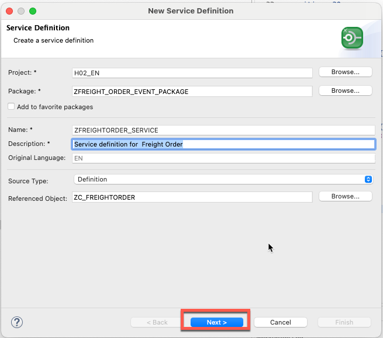
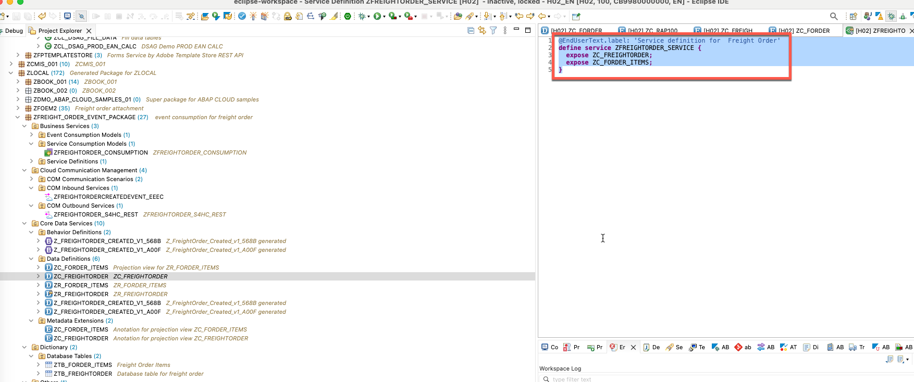
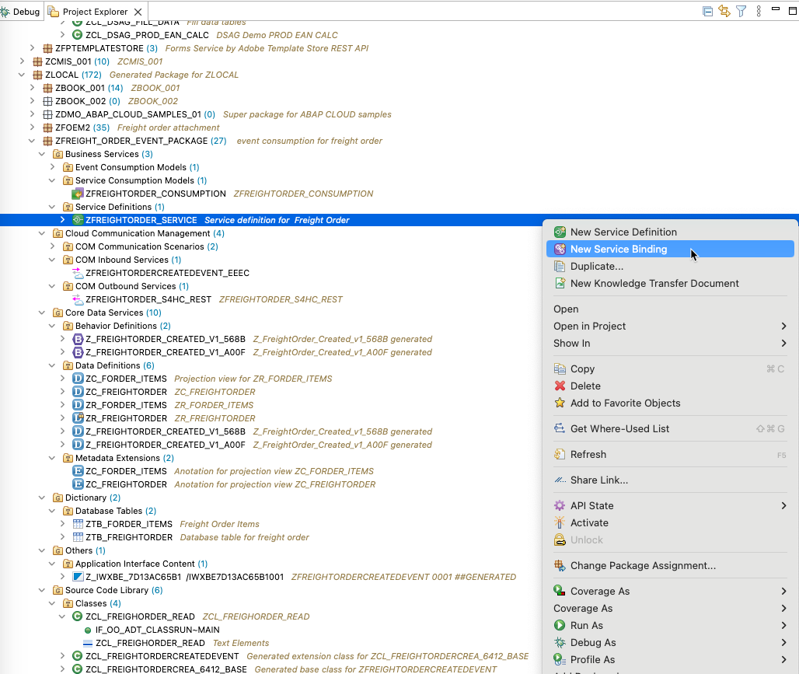
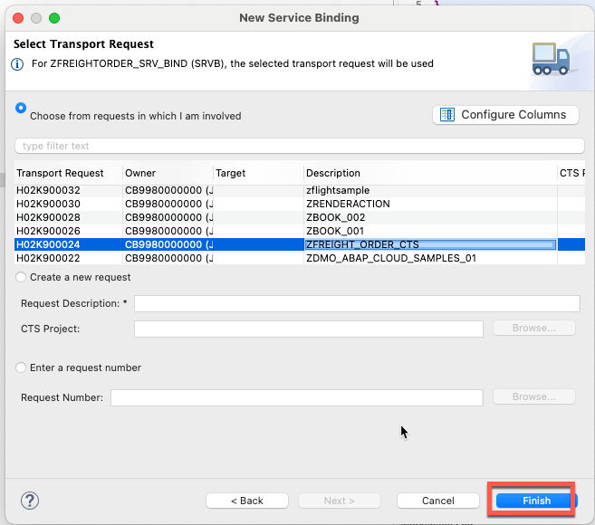

## Step 1: Create Service definition in Eclipse Adt.

Name:ZFREIGHTORDER_SERVICE
Description: Service definition for  Freight Order



Adjust the code as the following:
```
@EndUserText.label: 'Service definition for  Freight Order'
define service ZFREIGHTORDER_SERVICE {
  expose ZC_FREIGHTORDER;
  expose ZC_FORDER_ITEMS;
}
```


Push ***Command + S*** in Mac and activate it .

## Step 2: Create Service binding for ZFREIGHTORDER_SERVICE in Eclipse Adt.

Name:ZFREIGHTORDER_SRV_BIND
Description: Service Binding for ZFREIGHTORDER_SERVICE


Activate the service binding .

Publish the service binding.


