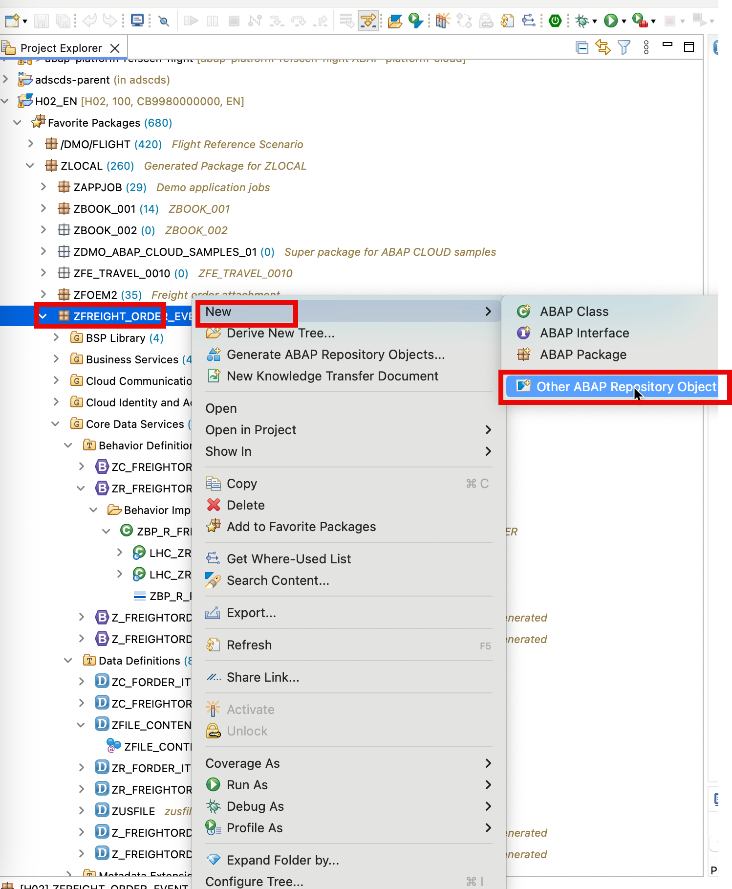
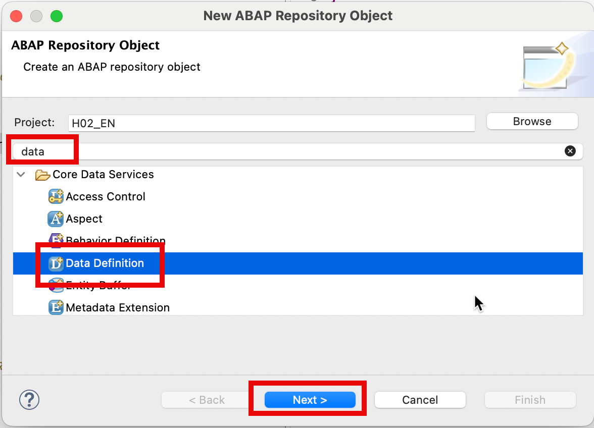
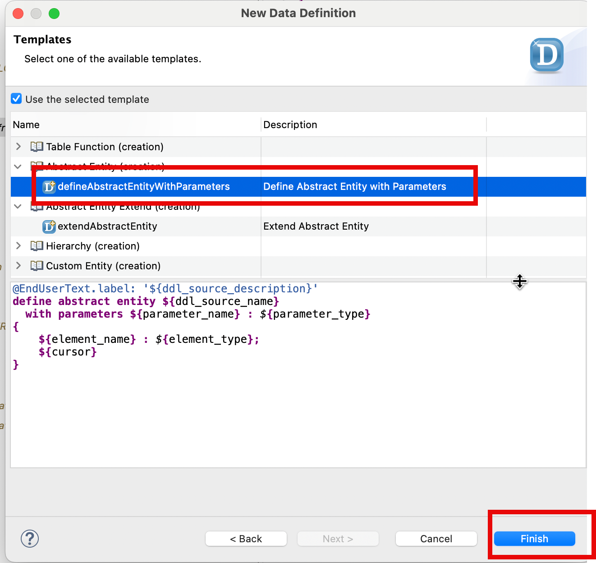
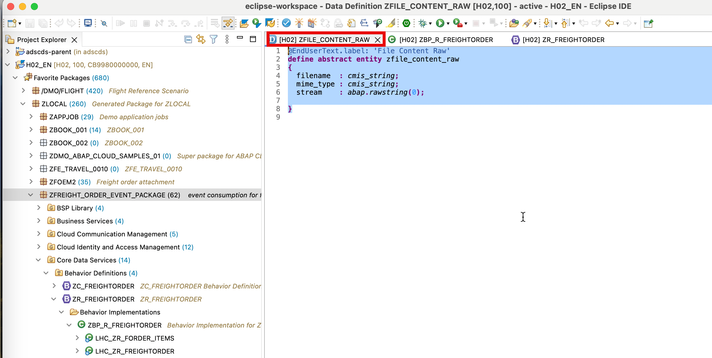
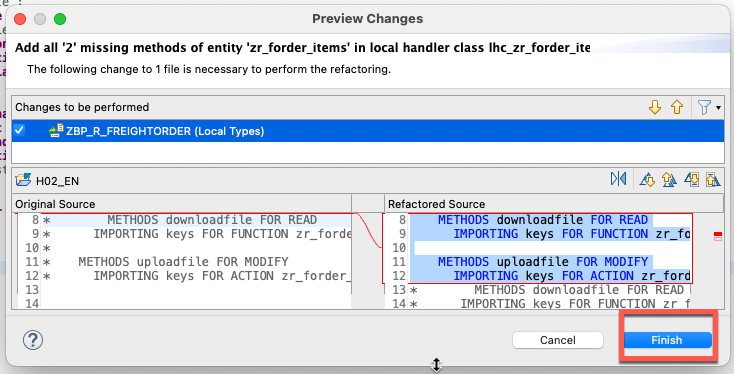

### Step 1: Create data definition zfile_content_raw which is used in action uploadfiles.



- Name: zfile_content_raw
- Description: File Content Raw




Adjust the code as the following:
```
@EndUserText.label: 'File Content Raw'
define abstract entity zfile_content_raw
{
  filename  : cmis_string;
  mime_type : cmis_string;
  stream    : abap.rawstring(0);
    
}
```

**Save and Activate the data definition**


### Step 2:  create behavior definition for view ZR_FREIGHTORDER 


Ajust the behavior definition as the following:

```
managed implementation in class zbp_r_freightorder unique;
strict ( 2 );

define behavior for ZR_FREIGHTORDER alias freightorder
persistent table ztb_freightorder
lock master
authorization master ( instance )
//etag master <field_name>
{
  mapping for ztb_freightorder corresponding
    {
      Transportationorderuuid    = transportationorderuuid;
      Transportationorder        = transportationorder;
      CarrierUuid                = carrier_uuid;
      Carrier                    = carrier;
      ShipperUuid                = shipper_uuid;
      Shipper                    = shipper;
      ShipperAddressId           = shipper_address_id;
      ConsigneeUuid              = consignee_uuid;
      Consignee                  = consignee;
      ConsigneeAddressId         = consignee_address_id;
      TranspPurgOrg              = transp_purg_org;
      TranspPurgGroup            = transp_purg_group;
      PurgOrgCompanyCode         = purg_org_company_code;
      CarrierAccountNumber       = carrier_account_number;
      TranspOrdInvoicingCarri    = transp_ord_invoicing_carri;
      CreatedByUser              = created_by_user;
      CreationDateTime           = creation_date_time;
      Transportationmode         = transportationmode;
      Transportationordertype    = transportationordertype;
      Transportationshippingtype = transportationshippingtype;
      Transppurgorgextid         = transppurgorgextid;
      TransportationModeCatego   = transportation_mode_catego;
      TranspOrdExecutionIsBl     = transp_ord_execution_is_bl;
      TransportationOrderExec    = transportation_order_exec;
      Repositoryid               = repositoryid;
      Fileobjectid               = fileobjectid;
    }
  //   create ;
  update;
  //     delete ;
  action uploadfile parameter zfile_content_raw result [1] $self;
  function downloadfile result [1] CMIS_S_CONTENT_RAW;
  association _items { create; }
}

define behavior for ZR_FORDER_ITEMS //alias <alias_name>
persistent table ztb_forder_items
lock dependent by _FREIGHTORDER
authorization dependent by _FREIGHTORDER
//etag master <field_name>
{
  mapping for ztb_forder_items corresponding
    {
      TransportationOrderItem  = transportation_order_item;
      TransportationOrderUuid  = transportation_order_uuid;
      TranspOrdItem            = transp_ord_item;
      TranspOrdItemType        = transp_ord_item_type;
      TranspOrdItemCategory    = transp_ord_item_category;
      TranspOrdItemDesc        = transp_ord_item_desc;
      SourceStopUuid           = source_stop_uuid;
      DestinationStopUuid      = destination_stop_uuid;
      ShipperUuid              = shipper_uuid;
      Shipper                  = shipper;
      ShipperAddressId         = shipper_address_id;
      ConsigneeUuid            = consignee_uuid;
      Consignee                = consignee;
      ConsigneeAddressId       = consignee_address_id;
      TranspBaseDocument       = transp_base_document;
      TranspBaseDocumentType   = transp_base_document_type;
      TranspBaseDocumentItem   = transp_base_document_item;
      TransportationEquipmentG = transportation_equipment_g;
      TransportationEquipmentT = transportation_equipment_t;
      TranspEquipmentPlateNum  = transp_equipment_plate_num;
      TranspEquipRegistration  = transp_equip_registration;
      TranspOrdItemPackageId   = transp_ord_item_package_id;
      ProductId                = product_id;
      MaterialFreightGroup     = material_freight_group;
      TransportationGroup      = transportation_group;
      TranspOrdItemQuantity    = transp_ord_item_quantity;
      TranspOrdItemQuantityU   = transp_ord_item_quantity_u;
      TranspOrdItemGrossWeig   = transp_ord_item_gross_weig;
      TranspOrdItemGrossWe2    = transp_ord_item_gross_we_2;
      TranspOrdItemGrossVolu   = transp_ord_item_gross_volu;
      TranspOrdItemGrossVo2    = transp_ord_item_gross_vo_2;
      TranspOrdItemNetWeight   = transp_ord_item_net_weight;
      TranspOrdItemNetWeig2    = transp_ord_item_net_weig_2;
      TranspOrdItemDngrsGds    = transp_ord_item_dngrs_gds;
      Repositoryid             = repositoryid;
      Fileobjectid             = fileobjectid;
    }
  update;
  //                delete     ;
  field ( readonly ) TransportationOrderUuid;
  action uploadfile parameter zusfile result [1] $self;
  function downloadfile result [1] CMIS_S_CONTENT_RAW;
  association _FREIGHTORDER;
}
```




**Before change, the code likes the following:**

```
CLASS lhc_zr_forder_items DEFINITION INHERITING FROM cl_abap_behavior_handler.

  PRIVATE SECTION.


    METHODS get_instance_authorizations FOR INSTANCE AUTHORIZATION
      IMPORTING keys REQUEST requested_authorizations FOR zr_forder_items RESULT result.
    METHODS downloadfile FOR READ
      IMPORTING keys FOR FUNCTION zr_forder_items~downloadfile RESULT result.

    METHODS uploadfile FOR MODIFY
      IMPORTING keys FOR ACTION zr_forder_items~uploadfile RESULT result.
*        METHODS downloadfile FOR READ
*      IMPORTING keys FOR FUNCTION zr_forder_items~downloadfile RESULT result.
*
*    METHODS uploadfile FOR MODIFY
*      IMPORTING keys FOR ACTION zr_forder_items~uploadfile RESULT result.


ENDCLASS.

CLASS lhc_zr_forder_items IMPLEMENTATION.

  METHOD get_instance_authorizations.
  ENDMETHOD.


  METHOD downloadfile.
  ENDMETHOD.

  METHOD uploadfile.
  ENDMETHOD.

ENDCLASS.

CLASS lhc_ZR_FREIGHTORDER DEFINITION INHERITING FROM cl_abap_behavior_handler.
  PRIVATE SECTION.

    METHODS get_instance_authorizations FOR INSTANCE AUTHORIZATION
      IMPORTING keys REQUEST requested_authorizations FOR zr_freightorder RESULT result.
    METHODS downloadfile FOR READ
      IMPORTING keys FOR FUNCTION zr_freightorder~downloadfile RESULT result.

    METHODS uploadfile FOR MODIFY
      IMPORTING keys FOR ACTION zr_freightorder~uploadfile RESULT result.


ENDCLASS.

CLASS lhc_ZR_FREIGHTORDER IMPLEMENTATION.

  METHOD get_instance_authorizations.
  ENDMETHOD.


  METHOD downloadfile.

  ENDMETHOD.

  METHOD uploadfile.

  ENDMETHOD.

ENDCLASS.
```

**Adjust the code likes the following:**

```
CLASS lhc_zr_forder_items DEFINITION INHERITING FROM cl_abap_behavior_handler.

  PRIVATE SECTION.
    CLASS-DATA mo_cmis_client TYPE REF TO if_cmis_client.


    METHODS get_instance_authorizations FOR INSTANCE AUTHORIZATION
      IMPORTING keys REQUEST requested_authorizations FOR zr_forder_items RESULT result.
    METHODS downloadfile FOR READ
      IMPORTING keys FOR FUNCTION zr_forder_items~downloadfile RESULT result.

    METHODS uploadfile FOR MODIFY
      IMPORTING keys FOR ACTION zr_forder_items~uploadfile RESULT result.


ENDCLASS.

CLASS lhc_zr_forder_items IMPLEMENTATION.


  METHOD get_instance_authorizations.
  ENDMETHOD.


  METHOD downloadfile.

    DATA:
      ls_content    TYPE cmis_s_content_raw,
      lt_properties TYPE cmis_t_client_property,
      ls_property   LIKE LINE OF lt_properties,
      ls_value      LIKE LINE OF ls_property-values,
*               item_for_update TYPE  zr_forder_items,
      wa1           LIKE  LINE OF  result.


    READ ENTITIES OF zr_freightorder IN LOCAL MODE
    ENTITY zr_forder_items
    FIELDS ( Repositoryid Fileobjectid ) WITH
    CORRESPONDING #( keys ) RESULT DATA(zitem).

    READ TABLE zitem INDEX 1 ASSIGNING FIELD-SYMBOL(<wa>) .

    IF mo_cmis_client IS NOT BOUND.
      CALL METHOD cl_cmis_client_factory2=>get_instance
        RECEIVING
          ro_client = mo_cmis_client.    " CMIS Client API
    ENDIF.


    CALL METHOD mo_cmis_client->get_content_stream
      EXPORTING
        iv_repository_id = <wa>-Repositoryid
        iv_object_id     = <wa>-Fileobjectid
      IMPORTING
        es_content       = DATA(lv_content).


    wa1-%tky = <wa>-%tky .
    MOVE-CORRESPONDING lv_content TO wa1-%param .
    APPEND wa1 TO result .
  ENDMETHOD.

  METHOD uploadfile.
    DATA:
      ls_content       TYPE  cmis_s_content_raw,
      lt_properties    TYPE cmis_t_client_property,
      ls_property      LIKE LINE OF lt_properties,
      ls_value         LIKE LINE OF ls_property-values,
      items_for_update TYPE TABLE FOR UPDATE  zr_forder_items.

    IF mo_cmis_client IS NOT BOUND.
      CALL METHOD cl_cmis_client_factory2=>get_instance
        RECEIVING
          ro_client = mo_cmis_client.    " CMIS Client API
    ENDIF.

    CALL METHOD mo_cmis_client->get_repository_info
      EXPORTING
        iv_repository_id   = 'zfoattachment001' "pass the id of the created repository
      IMPORTING
        es_repository_info = DATA(ls_repository).

    CLEAR: ls_property,  ls_value.
    ls_property-id        = cl_cmis_property_ids=>object_type_id.
    ls_value-string_value = cl_cmis_constants=>base_type_id-cmis_document. "specify the type as cmis:document
    APPEND ls_value TO ls_property-values.
    APPEND ls_property TO lt_properties.
    CLEAR: ls_property,  ls_value.
    ls_property-id        = cl_cmis_property_ids=>name. "specify the name
    READ TABLE keys INDEX 1 ASSIGNING FIELD-SYMBOL(<wa2>) .

    ls_value-string_value = <wa2>-%param-filename   .
    APPEND ls_value TO ls_property-values .
    APPEND ls_property TO lt_properties.
    CLEAR: ls_property,  ls_value.

    LOOP AT keys ASSIGNING FIELD-SYMBOL(<keyV>) .
      ls_content-filename = <keyV>-%param-filename .
      ls_content-mime_type = <keyV>-%param-mimetype.
      ls_content-stream =  <keyV>-%param-attachment .


      CALL METHOD mo_cmis_client->create_document(
        EXPORTING
          iv_repository_id = ls_repository-id
          it_properties    = lt_properties
          is_content       = ls_content
          iv_folder_id     = ls_repository-root_folder_id
        IMPORTING
          es_object        = DATA(ls_cmis_object) ).

      READ TABLE ls_cmis_object-properties-properties WITH KEY id = 'cmis:objectId' ASSIGNING FIELD-SYMBOL(<wa>).
      READ TABLE <wa>-value INDEX 1 ASSIGNING FIELD-SYMBOL(<wa1>).

      APPEND VALUE #(  %tky       = <keyV>-%tky
                    repositoryid = ls_repository-id
                    fileobjectid = <wa1>-string_value
                  ) TO items_for_update.

    ENDLOOP .

    MODIFY ENTITIES OF zr_freightorder IN LOCAL MODE
    ENTITY zr_forder_items UPDATE FIELDS ( Repositoryid Fileobjectid )
    WITH items_for_update .


    READ ENTITIES OF zr_freightorder IN LOCAL MODE
   ENTITY zr_forder_items
  ALL FIELDS WITH
    CORRESPONDING #( keys )
   RESULT DATA(items) .

    result = VALUE #( FOR item IN items ( %tky = item-%tky %param = item ) ) .
  ENDMETHOD.

ENDCLASS.

CLASS lhc_ZR_FREIGHTORDER DEFINITION INHERITING FROM cl_abap_behavior_handler.
  PRIVATE SECTION.
    CLASS-DATA mo_cmis_client TYPE REF TO if_cmis_client.

    METHODS get_instance_authorizations FOR INSTANCE AUTHORIZATION
      IMPORTING keys REQUEST requested_authorizations FOR zr_freightorder RESULT result.
    METHODS downloadfile FOR READ
      IMPORTING keys FOR FUNCTION zr_freightorder~downloadfile RESULT result.

    METHODS uploadfile FOR MODIFY
      IMPORTING keys FOR ACTION zr_freightorder~uploadfile RESULT result.


ENDCLASS.

CLASS lhc_ZR_FREIGHTORDER IMPLEMENTATION.

  METHOD get_instance_authorizations.
  ENDMETHOD.


  METHOD downloadfile.

    DATA:
      ls_content        TYPE cmis_s_content_raw,
      lt_properties     TYPE cmis_t_client_property,
      ls_property       LIKE LINE OF lt_properties,
      ls_value          LIKE LINE OF ls_property-values,
      header_for_update TYPE  zr_freightorder,
      wa1               LIKE  LINE OF  result.


    READ ENTITIES OF zr_freightorder IN LOCAL MODE
    ENTITY freightorder
    FIELDS ( Repositoryid Fileobjectid ) WITH
    CORRESPONDING #( keys ) RESULT DATA(zfreightorder).

    READ TABLE zfreightorder INDEX 1 ASSIGNING FIELD-SYMBOL(<wa>) .

    IF mo_cmis_client IS NOT BOUND.
      CALL METHOD cl_cmis_client_factory2=>get_instance
        RECEIVING
          ro_client = mo_cmis_client.    " CMIS Client API
    ENDIF.


    CALL METHOD mo_cmis_client->get_content_stream
      EXPORTING
        iv_repository_id = <wa>-Repositoryid
        iv_object_id     = <wa>-Fileobjectid
      IMPORTING
        es_content       = DATA(lv_content).


    wa1-%tky = <wa>-%tky .
    MOVE-CORRESPONDING lv_content TO wa1-%param .
    APPEND wa1 TO result .


  ENDMETHOD.

  METHOD uploadfile.
    DATA:
      ls_content        TYPE  cmis_s_content_raw,
      lt_properties     TYPE cmis_t_client_property,
      ls_property       LIKE LINE OF lt_properties,
      ls_value          LIKE LINE OF ls_property-values,
      header_for_update TYPE TABLE FOR UPDATE zr_freightorder.

    IF mo_cmis_client IS NOT BOUND.
      CALL METHOD cl_cmis_client_factory2=>get_instance
        RECEIVING
          ro_client = mo_cmis_client.    " CMIS Client API
    ENDIF.

    CALL METHOD mo_cmis_client->get_repository_info
      EXPORTING
        iv_repository_id   = 'zfoattachment001' "pass the id of the created repository
      IMPORTING
        es_repository_info = DATA(ls_repository).

    CLEAR: ls_property,  ls_value.
    ls_property-id        = cl_cmis_property_ids=>object_type_id.
    ls_value-string_value = cl_cmis_constants=>base_type_id-cmis_document. "specify the type as cmis:document
    APPEND ls_value TO ls_property-values.
    APPEND ls_property TO lt_properties.
    CLEAR: ls_property,  ls_value.
    ls_property-id        = cl_cmis_property_ids=>name. "specify the name
    READ TABLE keys INDEX 1 ASSIGNING FIELD-SYMBOL(<wa2>) .

    ls_value-string_value = <wa2>-%param-filename   .
    APPEND ls_value TO ls_property-values .
    APPEND ls_property TO lt_properties.
    CLEAR: ls_property,  ls_value.

    LOOP AT keys ASSIGNING FIELD-SYMBOL(<keyV>) .
      ls_content-filename = <keyV>-%param-filename .
      ls_content-mime_type = <keyV>-%param-mime_type.
      ls_content-stream =  <keyV>-%param-stream .


      CALL METHOD mo_cmis_client->create_document(
        EXPORTING
          iv_repository_id = ls_repository-id
          it_properties    = lt_properties
          is_content       = ls_content
          iv_folder_id     = ls_repository-root_folder_id
        IMPORTING
          es_object        = DATA(ls_cmis_object) ).

      READ TABLE ls_cmis_object-properties-properties WITH KEY id = 'cmis:objectId' ASSIGNING FIELD-SYMBOL(<wa>).
      READ TABLE <wa>-value INDEX 1 ASSIGNING FIELD-SYMBOL(<wa1>).

      APPEND VALUE #( %tky       = <keyV>-%tky
                    repositoryid = ls_repository-id
                    fileobjectid = <wa1>-string_value
                  ) TO header_for_update.


    ENDLOOP .

    MODIFY ENTITIES OF zr_freightorder IN LOCAL MODE
    ENTITY freightorder UPDATE FIELDS ( Repositoryid Fileobjectid )
    WITH header_for_update .


    READ ENTITIES OF zr_freightorder IN LOCAL MODE
   ENTITY freightorder
  ALL FIELDS WITH
    CORRESPONDING #( keys )
   RESULT DATA(headers) .

    result = VALUE #( FOR header IN headers ( %tky = header-%tky %param = header ) ) .


  ENDMETHOD.

ENDCLASS.
```

Activate the behavior definition .


### Step 3:  create behavior definition for view ZC_FREIGHTORDER 


Adjust the behavior code of  ZC_FREIGHTORDER as the following:

```
projection;
strict ( 2 );

define behavior for ZC_FREIGHTORDER //alias <alias_name>
{
//  use create;
  use update;
//  use delete;
  use action uploadfile;
  use function downloadfile;
  use association _items {create;}


}

define behavior for ZC_FORDER_ITEMS
{
  use update;
////  use delete;
  use action uploadfile;
  use function downloadfile;
use association _FREIGHTORDER;
}
```
Save and activate the behavior definition for ZC_FREIGHTORDER.
