## Prerequisites:

-  You have finished the [initial setting up for SAP Business Application Studio](https://help.sap.com/docs/bas/sap-business-application-studio/getting-started).
-  You have [created Dev Space with type SAP Fiori in SAP Business Application Studio](https://help.sap.com/docs/bas/sap-business-application-studio/working-in-dev-space-manager)


## Step 1: Login into BTP subaccount which has BTP ABAP Environment instance .


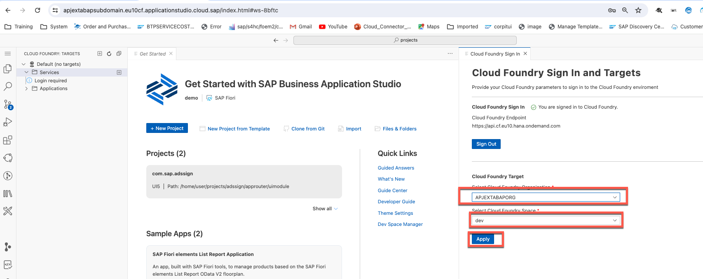


*Note: Pleae make sure that BTP Subaccount has instance BTP ABAP Environment. Please refer to the following screen shots * 


## Step 2:  Create Fiori Application in SAP Business Application Studio.


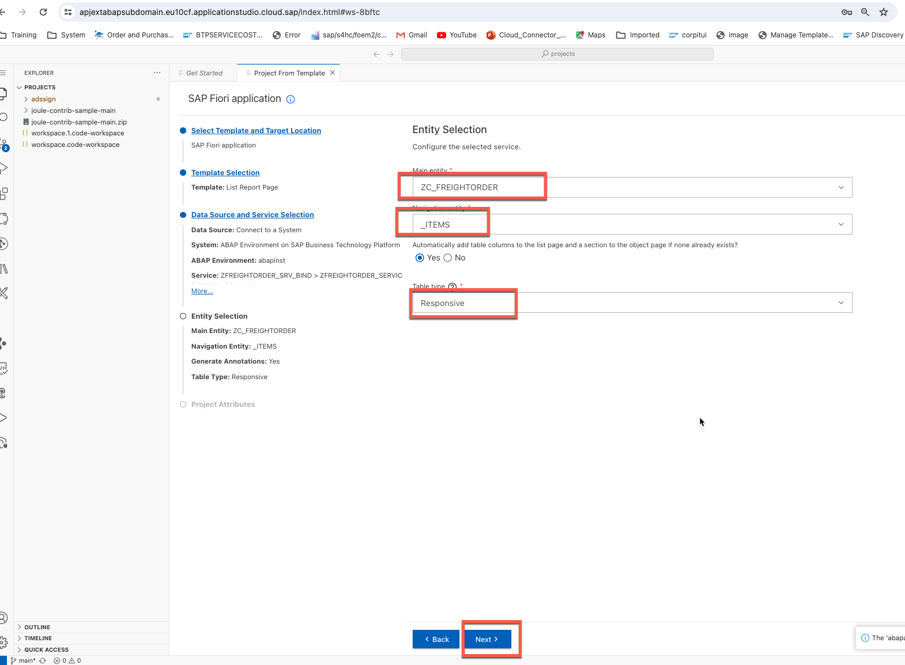

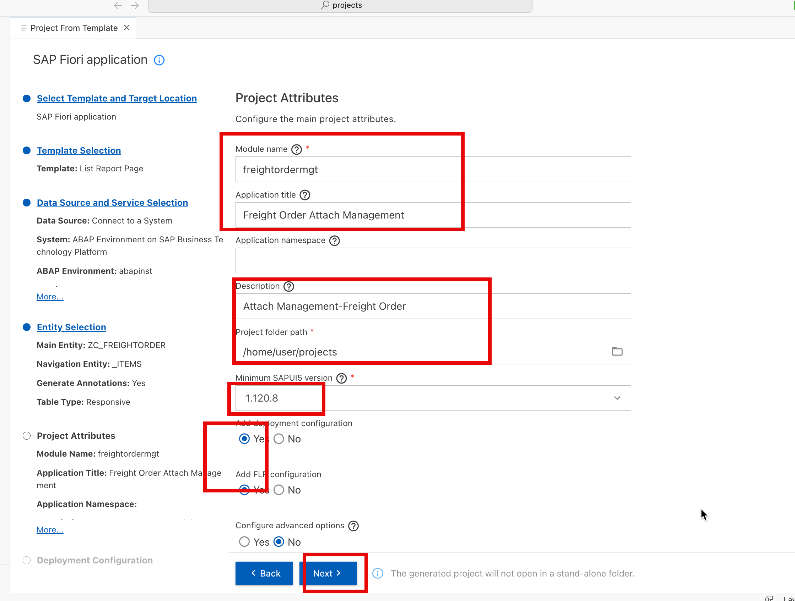

please use ui5 version 1.120.8

Module name: freightordermgt
Application title: Freight Order Attach Management
Description: Attach Management-Freight Order

SAPUI5 ABAP Repository: ZFREIGHTORDER
Package: ZFREIGHT_ORDER_EVENT_PACKAGE(Use your own package)
Transport Request: H02K900024 (use your own transport request)

Semantic Object: FreightOrder
Action: display
Title: Freight Order
Subtitle: Attach Management


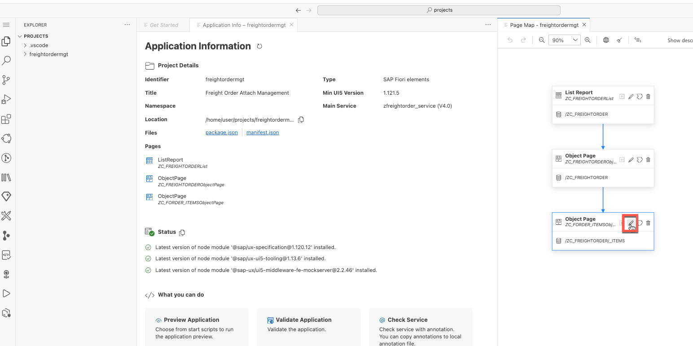
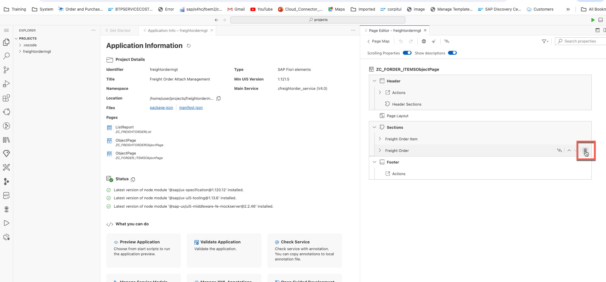
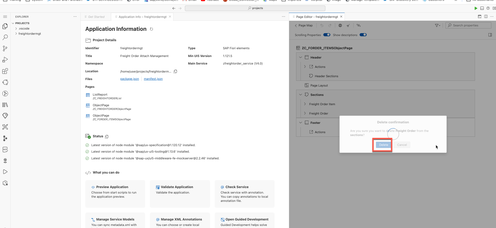

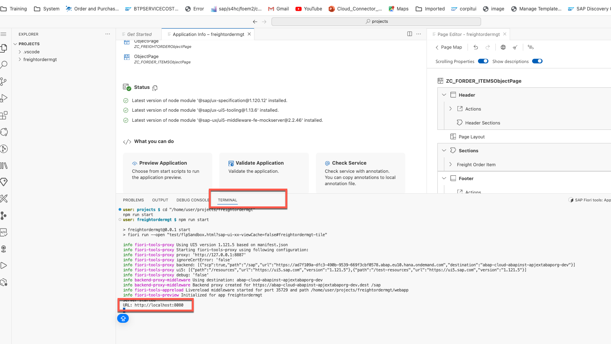


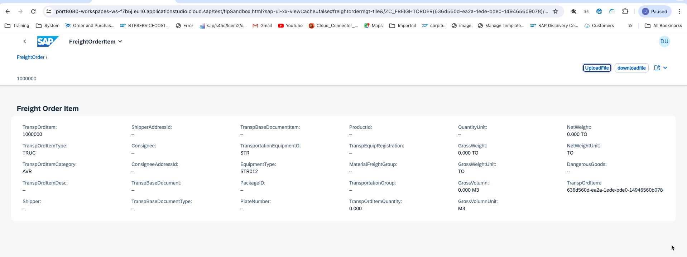


## Step 3, Add custom controller to Object Page view.
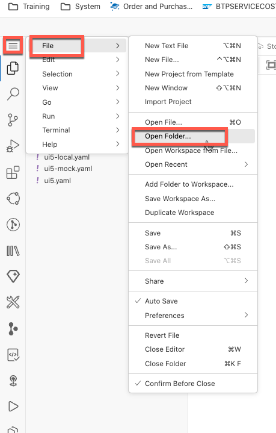

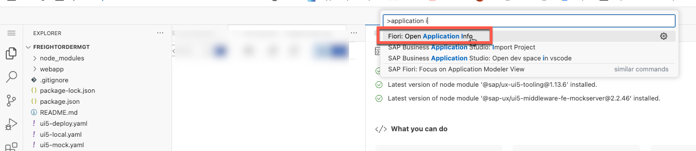

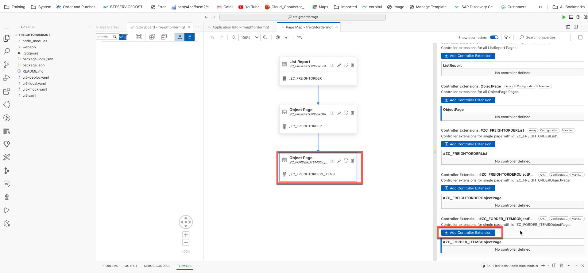
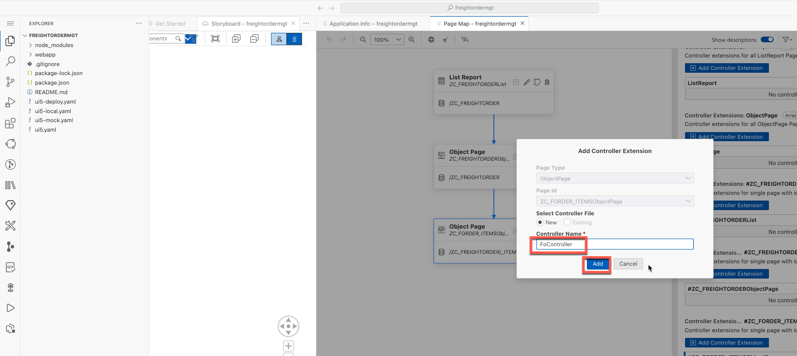

Controller Name: FoController


Adjust FoController as the following code .

```javascript

sap.ui.define(['sap/ui/core/mvc/ControllerExtension','sap/ui/model/json/JSONModel','sap/m/MessageToast','sap/base/security/URLWhitelist','sap/ui/core/message/Message', 'sap/ui/core/message/MessageType'], function (ControllerExtension,JSONModel,MessageToast,URLWhitelist,Message, MessageType) {
	'use strict';

	return ControllerExtension.extend('freightordermgt.ext.controller.FoController', {
		// this section allows to extend lifecycle hooks or hooks provided by Fiori elements
		pDialog : null,
		pdf_content: null,
		uploadfiles: function() {
			if (!this.pDialog) { 	
				this.base.getExtensionAPI().loadFragment({
					name: "freightordermgt.ext.fragment.fileselector"
				}).then(function(oDialog){
					// oDialog.open();
					this.pDialog = oDialog;
					oDialog = null;
					this.pDialog.open();
				 var oFileUploader = this.pDialog.getContent('uploadSet')[0];
				 if(oFileUploader){
					oFileUploader.removeAllItems();
				 }				
				}.bind(this)).catch(error=>{alert(error.message)})
			}else{
				var oFileUploader =  this.pDialog.getContent('uploadSet')[0];
				if(oFileUploader){
				   oFileUploader.removeAllItems();
				}
				this.pDialog.open();

			}
		
		},
		showPdf: function(oEvent){
			let showPdf = null;
			var oModel = this.base.getExtensionAPI().getModel();
		   //  var sPath = oModel.getBindings()[0].getContext().sPath;
		   var fileRep =  oModel.getBindings().filter(bn=>{ return bn.sPath=='Repositoryid' })[0].vValue
		   var fileObj =  oModel.getBindings().filter(bn=>{ return bn.sPath=='Fileobjectid' })[0].vValue

			const sFunctionname = "com.sap.gateway.srvd.zfreightorder_service.v0001.downloadfile";
			var sPath = this.getView().getBindingContext().getPath();
			const oFunction = oModel.bindContext(`${sPath}/${sFunctionname}(...)`);
	
		   oFunction.execute().then(function(){
			const oContext = oFunction.getBoundContext();
			var filename = oContext.getProperty('FILENAME');
			var stream = oContext.getProperty('STREAM');
			 stream = stream.replaceAll('_','/').replaceAll('-','+');
			 const deccont = atob(stream);			
			const byteNumbers = new Array(deccont.length);
			for (let i = 0; i < deccont.length; i++) {
				byteNumbers[i] = deccont.charCodeAt(i);
			}
			const byteArray = new Uint8Array(byteNumbers);
			var blob = new Blob([byteArray],{type: "application/pdf"});
			const pdfurl = URL.createObjectURL(blob);
			let oPdfmodel = new JSONModel({
				Source: pdfurl,
				Title: filename,
				Height: "1000px"
			});
			URLWhitelist.add("blob");
			this.getView().setModel(oPdfmodel,"pdf");
		}.bind(this)).catch(err=>{
				console.log('function err happened');
				console.log(err);
			});

			if (fileRep){
				showPdf = true ;
			}else{
				showPdf = false;
			};
 
			let oPdfview = new JSONModel({
				Viewshow: showPdf
			});
			 this.getView().setModel(oPdfview,"pdfview");	

		},
		onUploadSet:  function(oEvent) {
			var oFileUploader = this.pDialog.getContent('uploadSet')[0];
			var oFile = oFileUploader.getItems()[0].getFileObject();
			var sFileName = oFile.name;
			var iFileLen = oFile.size;
			var sFileType = oFile.type;
			// console.log(this.pdf_content);
			const oExtensionAPI = this.base.getExtensionAPI();
			// var view1 = this.getView();
			var oModel = oExtensionAPI.getModel();
			const sFunctionname = "com.sap.gateway.srvd.zfreightorder_service.v0001.uploadfile";
			var sPath = this.getView().getBindingContext().getPath();

			// let sRaw = String.raw`${this.pdf_content}`;
			
			let sMimtype = sFileName.split(".")[sFileName.split(".").length-1];

			

			const oFunction = oModel.bindContext(`${sPath}/${sFunctionname}(...)`);
			oFunction.setParameter("filename",sFileName);
			oFunction.setParameter("mimetype",sMimtype);
			var content = btoa(this.pdf_content);

			oFunction.setParameter("attachment",content); 
		   oFunction.execute().then(result=>{
			MessageToast.show("File Uploaded into BTP CMIS!");
			// console.log(result);
			// this.pDialog.close();
		}).catch(err=>{
			console.log(err);
		   }).finally(this.pDialog.close());
			
	
			  /* TODO:Call to OData */
		  },
		  onCloseDialog: function (oEvent) {        
			// alert("close clicked");   
			  this.pDialog.close();
		  },
		  onItemRemoved:function (oEvent) {
            console.log("File Remove/delete Event Fired!!!")  
            /* TODO: Clear the already read excel file data */          
        },
        onUploadSetComplete: function (oEvent) {

            var oFileUploader = this.pDialog.getContent('uploadSet')[0];
            var oFile = oFileUploader.getItems()[0].getFileObject();
            var reader = new FileReader();

            reader.onload = (e)=>{
                this.pdf_content = e.currentTarget.result;
                // console.log(this.pdf_content);
            }
			reader.readAsBinaryString(oFile);
            MessageToast.show("Upload Successful");

            /* TODO: Read excel file data*/
        },
        onItemRemoved:function (oEvent) {
            console.log("File Remove/delete Event Fired!!!")  
            /* TODO: Clear the already read excel file data */          
         },

		
		
		
		override: {
			/**
             * Called when a controller is instantiated and its View controls (if available) are already created.
             * Can be used to modify the View before it is displayed, to bind event handlers and do other one-time initialization.
             * @memberOf freightordermgt.ext.controller.FoController
             */
			onInit: function () {
				// you can access the Fiori elements extensionAPI via this.base.getExtensionAPI
				var oModel = this.base.getExtensionAPI().getModel();
			},
			routing: {
				onAfterBinding: function (oBindingContext, mParameters) {
					var extensionAPI = this.base.getExtensionAPI(),
						messages = [
							new Message({
								message: "onAfterBinding: Context bound",
								type: MessageType.Information
							})
						];
					extensionAPI.showMessages(messages);
				}

			},

			onAfterRendering: function(){
				let oPdfview = new JSONModel({
					Viewshow: false
				});

				this.getView().setModel(oPdfview,"pdfview");


			}
		}
	});
});


```


## Step 4, Add custom action in item Object Page view Header for Uploading File.


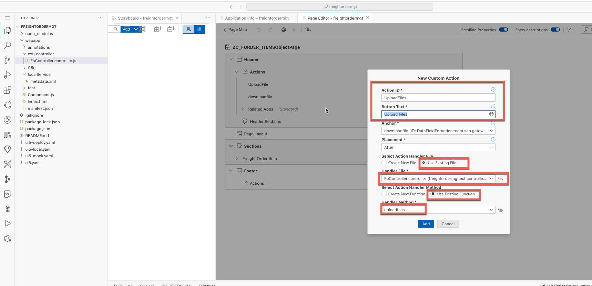
Action ID:UploadFiles
Button Text: Upload Files


## Step 5, Add custom section for Attachment View in item Object Page view.

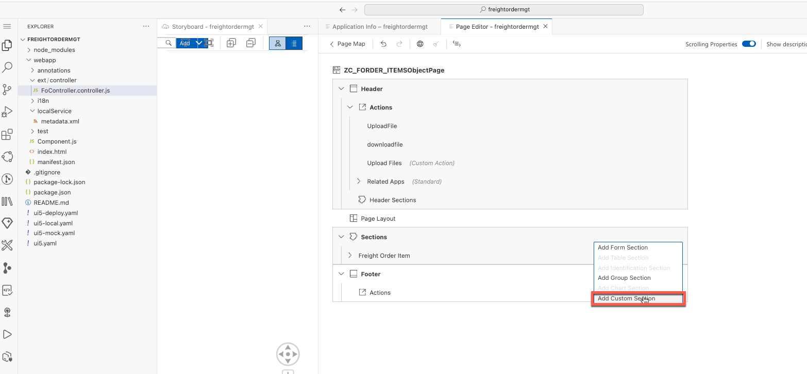
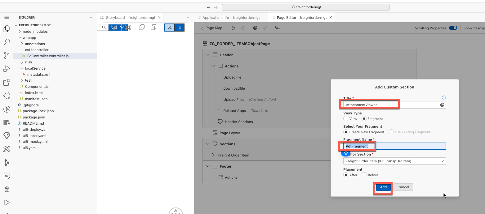

Title: AttachmentViewer
Fragment Name: PdfFragment


Adjust the fragement code as the following:
```xml
<core:FragmentDefinition xmlns:core="sap.ui.core" xmlns="sap.m" xmlns:macros="sap.fe.macros" validationSuccess=".extension.freightordermgt.ext.controller.FoController.onFragVali" >
		<ScrollContainer id="_IDGenScrollContainer1"
		height="100%"
		width="100%"
		horizontal="true"
		vertical="true" visible="{pdfview>/Viewshow}">
		<FlexBox id="_IDGenFlexBox1" direction="Column" renderType="Div" class="sapUiSmallMargin">
			<PDFViewer id="_IDGenPDFViewer1" source="{pdf>/Source}" isTrustedSource="true" title="{pdf>/Title}" height="{pdf>/Height}" >
				<layoutData>
					<FlexItemData id="_IDGenFlexItemData1" growFactor="1" />
				</layoutData>
			</PDFViewer>
		</FlexBox>
	</ScrollContainer>
</core:FragmentDefinition>

```
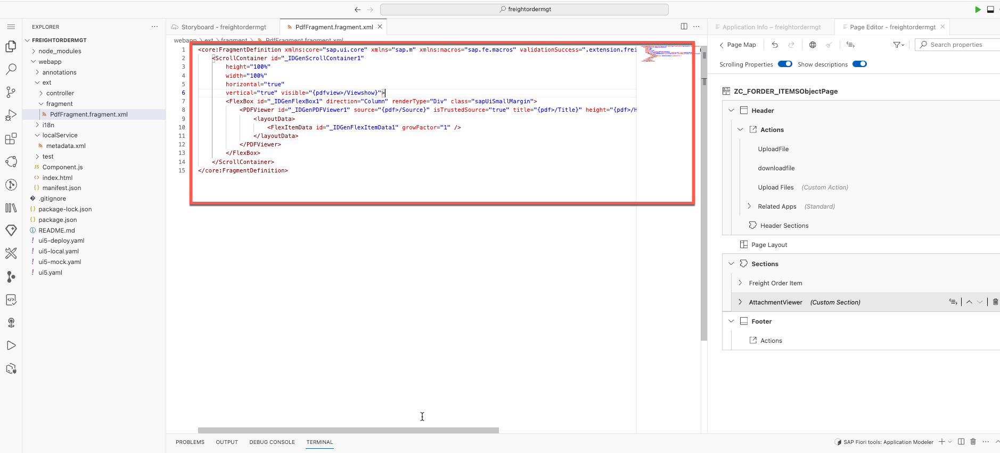

## Step 5, Add fragment for uploading file under ext/fragment
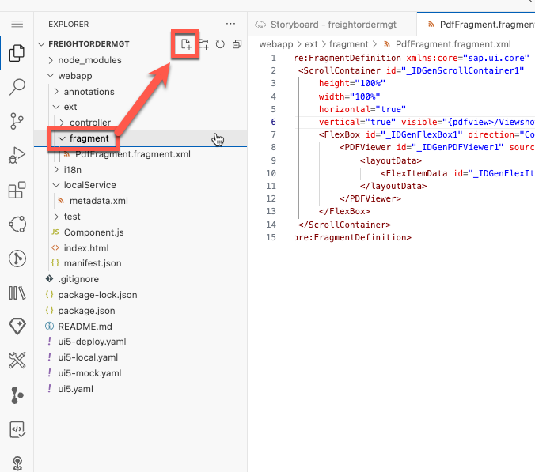
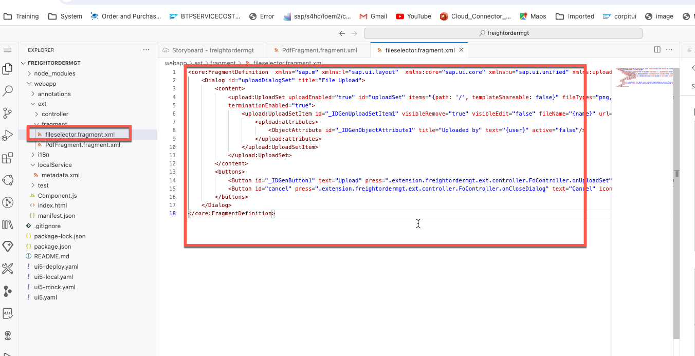


**please change the file name to : fileselector.fragment.xml**


Adjust the fragement code as the following:
```XML
<core:FragmentDefinition  xmlns="sap.m" xmlns:l="sap.ui.layout"  xmlns:core="sap.ui.core" xmlns:u="sap.ui.unified" xmlns:upload="sap.m.upload" >
	<Dialog id="uploadDialogSet" title="File Upload">
        <content>
            <upload:UploadSet uploadEnabled="true" id="uploadSet" items="{path: '/', templateShareable: false}" fileTypes="png,pdf,txt" maxFileNameLength="200" beforeUploadStarts=".extension.freightordermgt.ext.controller.FoController.onBeforeUploadStart" uploadCompleted=".extension.freightordermgt.ext.controller.FoController.onUploadSetComplete" afterItemRemoved=".extension.freightordermgt.ext.controller.FoController.onItemRemoved"
            terminationEnabled="true">
                <upload:UploadSetItem id="_IDGenUploadSetItem1" visibleRemove="true" visibleEdit="false" fileName="{name}" url="/upload">
                    <upload:attributes>
                        <ObjectAttribute id="_IDGenObjectAttribute1" title="Uploaded by" text="{user}" active="false"/>
                    </upload:attributes>
                </upload:UploadSetItem>
            </upload:UploadSet>
        </content>
        <buttons>        
            <Button id="_IDGenButton1" text="Upload" press=".extension.freightordermgt.ext.controller.FoController.onUploadSet" icon="sap-icon://upload-to-cloud" type="Emphasized"/>
            <Button id="cancel" press=".extension.freightordermgt.ext.controller.FoController.onCloseDialog" text="Cancel" icon="sap-icon://cancel"/>
        </buttons>
	</Dialog>
</core:FragmentDefinition>

```


## Step 6, Add custom action for Attachment View in item Object Page view Header.


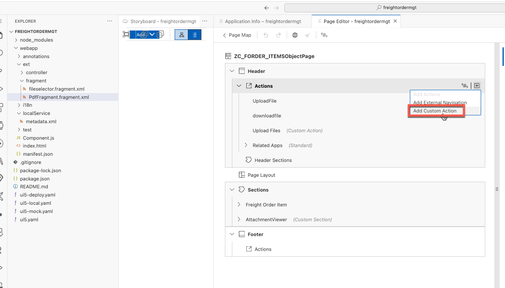


Action ID: showpdf
Button Text: Show PDF


## Step 7, Application preview and testing.


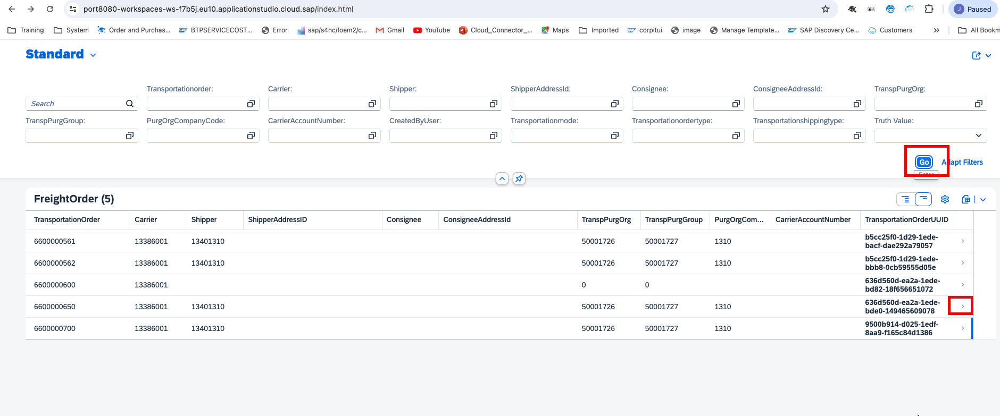


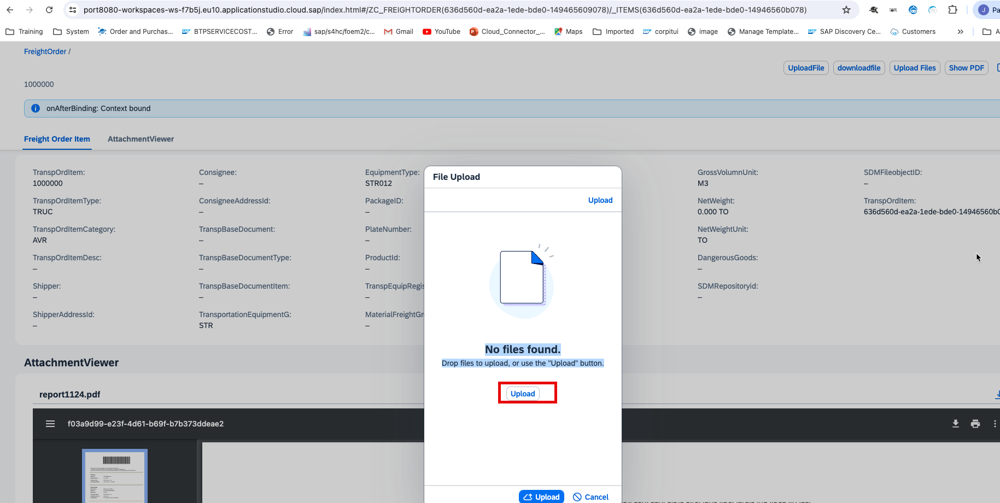
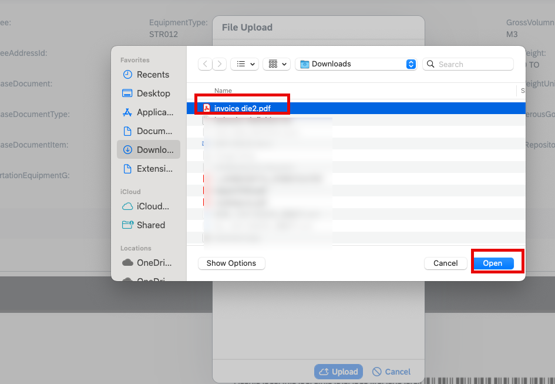
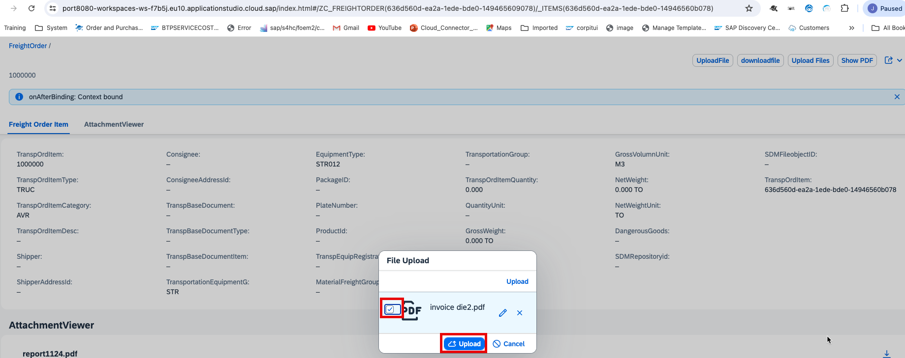

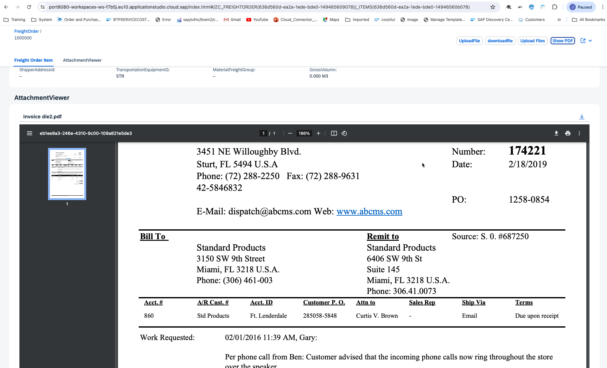


## Step 9: Deploy the Fiori application to BTP ABAP Environment.


Check the fiori application in Eclipse ADT .


