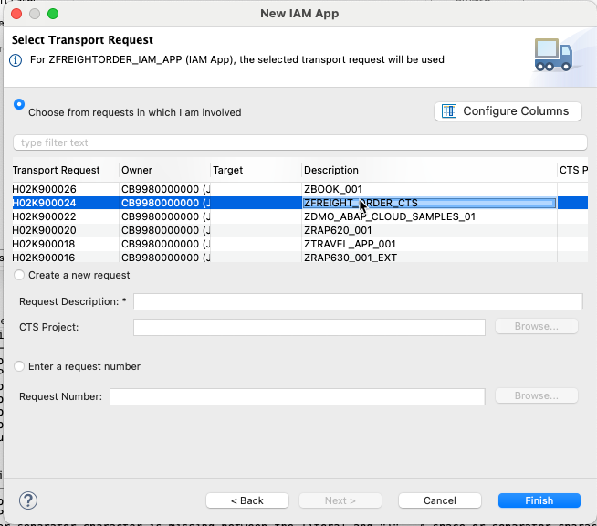
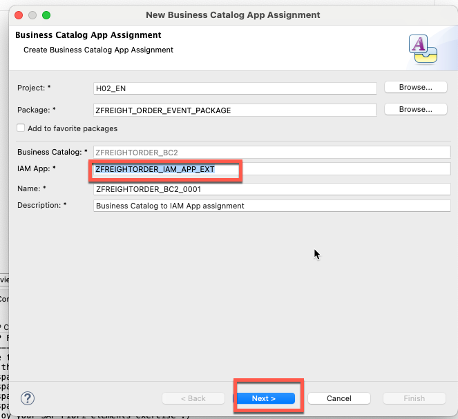
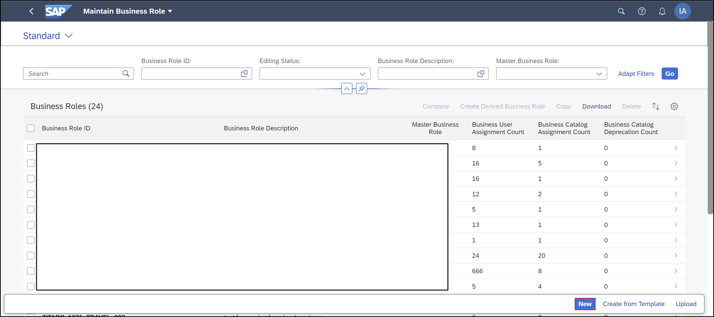
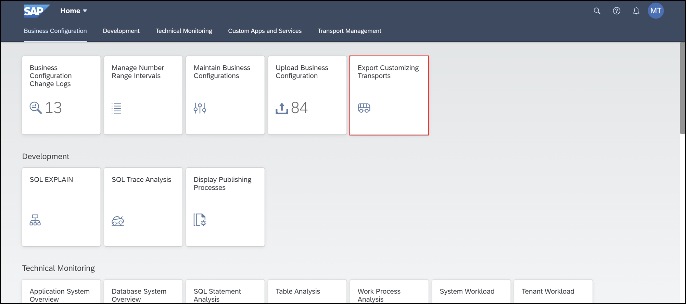
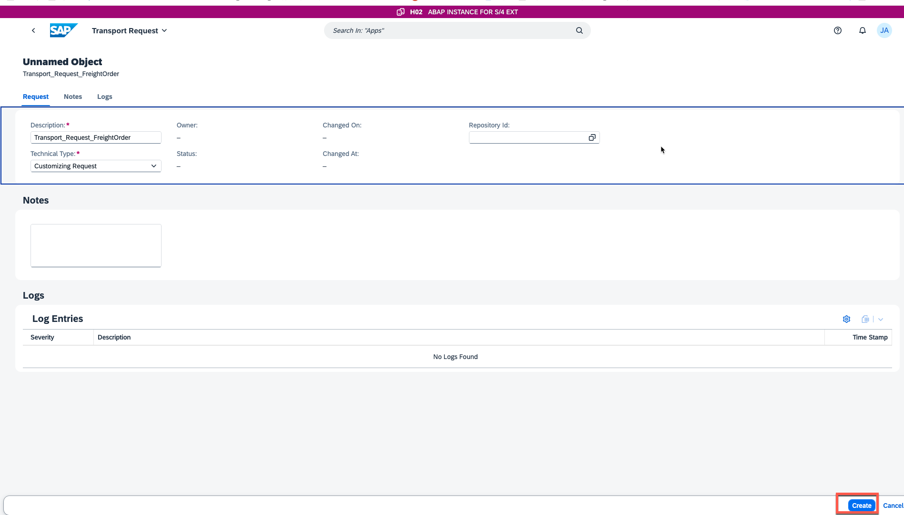

## 1. Create IAM App

In Eclipse right-click your package ZFREIGHT_ORDER_EVENT_PACKAGE and select New > Other Repository Object.

Create a new IAM App:

- Name: ZFREIGHTORDER_IAM_APP
- Description: FreightOrder Management IAM APP

Click Finish.

Maintain Item Id

Select following:

- Service Type: OData V4
- Service Name: ZFREIGHTORDER_SRV_BIND

Click on Publish Locally

## 2. Create business catalog

Create a new business catalog:
- Name: ZFREIGHTORDER_BC2
- Description: Freight Order Management Business Catalog

Fill IAM App field with **ZFREIGHTORDER_IAM_APP_EXT** and click next.

## 3. Create business role
Right-click on your ABAP system in the project explorer of ADT and select Properties. Click ABAP Development and copy the system URL.

Log in to your ABAP system as an administrator.

Select Maintain Business Roles.

Click New.

Create new business role:

- Business Role ID: BR_Z_FREIGHTORDER
- Business Role Description: Freight Order Business Role

Assign you user account to the business role.

## 4: Create transport request or use default transport request

Log in to your system and select the Export Customizing Transports tile.

Click Go.

Now you can see all transport request.

Create new transport request:

- Description: Transport_Request_FreightOrder
- Type: Customizing Request

Click Create.

If the Transport Category is not default, click **change Category** to change it to default .

## 5. Create Launchpad Space.

Select the Manage Launchpad Spaces tile.

Create new space and page:

- Space ID: ZFREIGHTORDER_APP
- Space description: Space for Freight Order
- Space title: Freight Order Management Application
- Page ID: ZFREIGHTORDER_APP
- Page description: Page for Freight Order Management
- Page title: Freight Order Management
- Transport: Transport_Request_FreightOrder

Go back to the SAP Fiori homepage and select the Maintain Business Roles tile.

Open the Manage Launchpad Pages tile.

