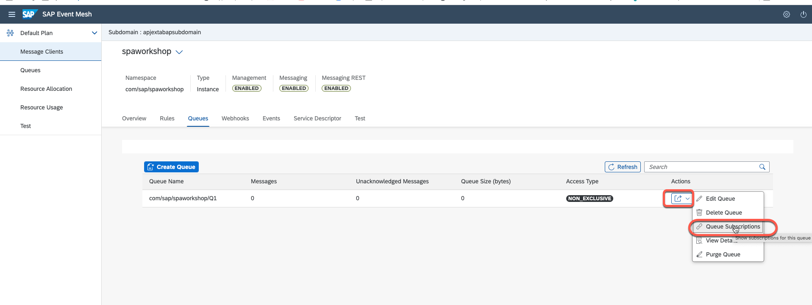

## Segtion 3: Create event Q and subscribe to freight order created topic in BTP Event Mesh Application.
### Step 1: Create event Q.

### Step 2 : Queue subscribtion.

    Add topic:
    com/sap/spaworkshop/ce/sap/s4/beh/FreightOrder/Created/v1

    Add another topic:
    com/sap/spaworkshop/ce/sap/s4/beh/FreightOrder/Created/*

